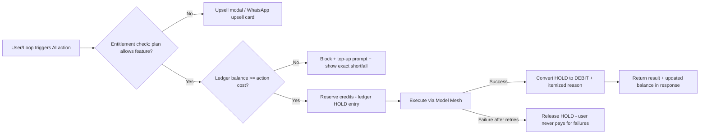
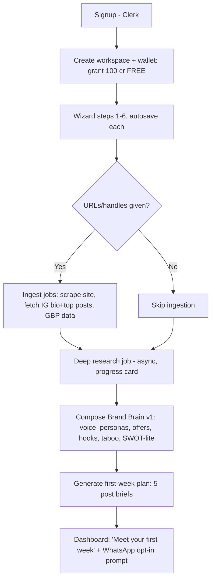
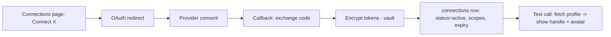
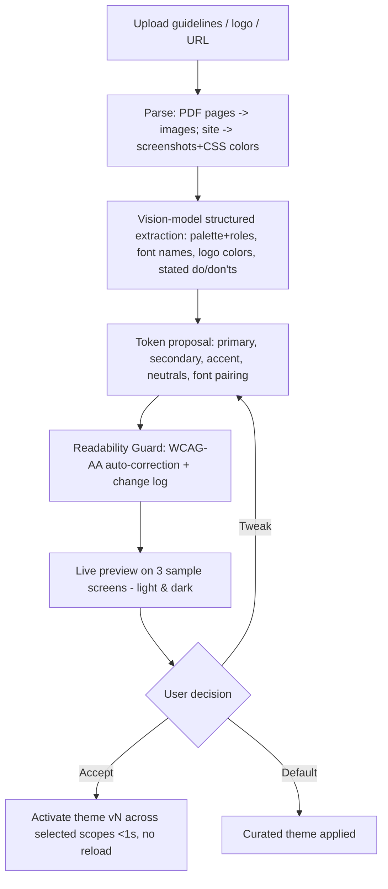
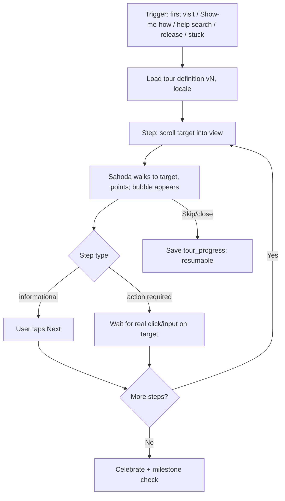

# FSD — SAHODA LABS · AI Marketing OS
**Functional Specification Document · v3.0 FINAL · Companion to PRD v3.0**
Defines exact behavior per module: inputs, outputs, states, validation, errors, credit charges, and workflows. Anything not specified here defaults to the PRD.

---

## 0. Cross-Cutting Rules

**0.1 Credit enforcement (applies to every AI action).**

Rules: charges are atomic (double-entry ledger, TSD §9); failed generations are never charged; partial batch failures charge only completed units; every debit stores `action_type`, `object_id`, `model_used`, `cogs_estimate` for the transparency UI.

**0.2 Autonomy Dial semantics (per channel, per workspace).**

| Level | Sahoda may… | Requires |
|---|---|---|
| L0 Suggest | Create ideas/briefs only | — |
| L1 Draft | Create full drafts into Planner (status=Draft) | — |
| L2 Approve-to-publish | Schedule; publish **only after** explicit approval (app/WhatsApp) | Approval within TTL (default 20h) else expires |
| L3 Autopilot | Publish without per-item approval | Guardrails pass (0.3), account ≥30 days, Growth+ plan, kill switch visible |

**0.3 Guardrails (evaluated before any publish, all levels).** Taboo-topic list (Brand Brain), brand-safety classifier (economy model pass/fail with reason), per-day post cap per channel, weekly credit budget for Loop, quiet hours, media-spec validation, duplicate-content check (no identical post to same channel within 30 days). Any failure → item parked in Review with the reason; L3 items additionally notify via Chat-Ops.

**0.4 Error taxonomy (uniform across modules).** `VALIDATION_ERROR` (zod, field-level messages) · `ENTITLEMENT_ERROR` · `CREDIT_INSUFFICIENT` · `PROVIDER_ERROR` (AI/platform; auto-retried per policy, then surfaced with plain-language explanation + "we didn't charge you") · `TOKEN_EXPIRED` (→ reconnect flow) · `GUARDRAIL_BLOCKED` (reason shown) · `RATE_LIMITED`. All errors logged with trace ID shown to user for support.

**0.5 States shared vocabulary.** Content: `idea → draft → review → approved → scheduled → publishing → published | failed | expired`. Jobs: `queued → running → succeeded | failed(retryable) | failed(final) | canceled`.

---

## M1 · Onboard & Brand Brain

**Purpose:** convert a stranger into a workspace with Brand Brain v1 and a first-week plan in ≤10 minutes.

**Inputs:** business name, category, location(s), language(s) (EN + HI at launch), website URL (optional), IG handle (optional), GBP link (optional), 1–3 products/offers, audience description, tone sliders (3), taboo topics, logo/colors (optional), goals (leads/sales/awareness), **Look & Feel step** — choose a default theme or Brand Skin (upload brand-guideline PDF/images, or extract from logo/site URL); full behavior in M13. The accepted theme applies live to the remaining wizard steps — an instant "the app is already mine" moment.

**Flow:**


**Outputs:** `brand_memory v1` (structured JSON per TSD schema), `research_reports` row, 5 draft briefs in Planner (L1 behavior regardless of dial, since it's onboarding), WhatsApp opt-in state.

**Credits:** Onboarding bundle = 50 cr (research) charged **from the free grant**; if grant insufficient (returning user), show cost before running. First-week briefs = free (bundled).

**Validation & edge cases:** URL unreachable → proceed with manual data + note in report; IG private/invalid → skip gracefully; research job >3 min → allow user to continue exploring, notify on completion (in-app + WhatsApp if opted); resume wizard from any step for 30 days; duplicate workspace name allowed (slug uniquified).

**Brand Brain editor:** sectioned editor with field-level history; AI writebacks (from M8 insights) appear as pending diffs — user sees "Sahoda learned: carousels outperform single images 2.1×. Add to Brain?" Accept/Reject; auto-accept at L3 with weekly digest of changes; revert any version ≤12 months.

**Intake & resolution mechanics (adopted from the founder's Signal Console demo):** the Brand Brain intake is organised as **Source + five channels** — Customer, Brand, Hook, Voice, Taboo — presented as a tabbed wizard. A **Signal Clarity meter** (waveform that visually resolves from noise to a clean brand-orange wave) reflects % of tracked fields completed and gamifies depth without gating: **blank fields never block** — resolution infers sensibly from what was provided and never invents specific facts. Voice captures **formality and energy as 1–5 sliders** plus never-use phrases. "Resolve" runs the `brand_guidelines` task through the Model Mesh (Standard tier, brand context prompt-cached) with a **strict JSON contract**: `{voice{descriptor, formality_label, signature_phrases[3], banned_phrases[]}, brand_persona{archetype, one_liner, core_values[3]}, customer_persona{one_liner, primary_pain_point, primary_fear, desired_identity}, hook{core_promise, primary_emotion, sample_hooks[3]}, taboo{red_lines[]}, alignment{signal_lock: strong|moderate|weak, note}}` — zod-validated with one repair retry, then persisted as `brand_memory` v1 (`payload`, `source='resolved'`). The **Signal Lock** verdict surfaces input conflicts (weak = contradictory channels, with a plain-language note) before the user leaves onboarding. Results render as cards (voice, personas, hook system with 3 sample hooks written *in the resolved voice*, red lines) with Copy-JSON parity, an "Adjust inputs" round-trip, and the Pending Learnings panel (memory_events) beneath — accepting a learning bumps the version live so the "living memory" is felt, not explained.

---

## M2 · The Loop

**Purpose:** the weekly autonomous cycle. One `loop_cycle` per workspace per ISO week.

**Trigger:** Sunday 21:00 workspace-local (configurable), or manual "Plan my week now."

**Cycle stages (state machine):** `collect → reflect → plan → create → test → stage → report`.
1. **Collect:** pull last-7-day normalized metrics, unresolved inbox count, Radar digest (if enabled), calendar events/festivals.
2. **Reflect:** insight pass → 1–3 learnings; each proposed as Brand Brain diff.
3. **Plan:** 5–7 post briefs mapped to channels/slots (best-time model), themed to goals; respects weekly credit budget setting.
4. **Create:** drafts + platform variants for each brief (charged per action list).
5. **Test:** Twin pre-flight on each (if plan includes Twin); attach scores; auto-pick best variant when confidence high.
6. **Stage:** per Autonomy Dial — L1 park in Planner; L2 send approval cards (batch card via WhatsApp: Approve all / pick); L3 schedule directly (guardrails already passed).
7. **Report:** Monday 08:30 CMO Report (in-app + WhatsApp + weekly email): last week's top/bottom post with why, learnings applied, this week's plan, credits used vs budget.

**Credits:** cycle orchestration = 20 cr; creations/tests within it charge their own listed prices (all shown in the plan's cost preview **before** stage 4 runs; user can trim briefs to fit budget — at L3 the budget cap trims automatically, lowest-priority first).

**Controls:** pause Loop (skips cycles, no charge), per-channel dial, weekly budget slider (default 150 cr), regenerate plan (10 cr), kill switch (cancels all scheduled Loop items instantly, releases holds).

**Edge cases:** zero connected channels → cycle produces plan + site/blog suggestions only, prompts to connect; metrics stale >48h → report flags data freshness; approval TTL expiry → items expire, counted in next report; two devices approving simultaneously → idempotent by item ID.

---

## M3 · Create Suite

### 3.1 Post editor
**Inputs:** title (internal), body, media (upload ≤50 MB, generate, studio, library), channel set, schedule datetime or "best time," Twin toggle.
**Behavior:** on channel select, generate **platform variants** (one canonical body + per-platform adaptation honoring the Constraint Engine: char limits, hashtag norms, link handling, media specs, GBP CTA types, WhatsApp template rules). Variants editable independently; "relink" re-syncs from canonical. Inline AI: rewrite/shorten/hook-ify (1 cr each, selection-scoped). Autosave 2s debounce; conflict = last-write-wins with toast + restore option.
**Validation:** ≥1 channel; schedule ≥5 min future; media validated per target platform (dims/size/type) *at attach time*, not at publish; over-limit variant blocks only that channel with fix-it CTA.
**States:** per shared vocabulary; per-channel sub-status after publish (`published(ids)`, `failed(reason)` per platform — one platform's failure never blocks others).

### 3.2 Campaigns
**Inputs:** objective prompt, duration (7/14/30/custom ≤60 days), post count (≤ duration×2, hard cap 40), audience override (optional), channels.
**Output:** campaign object with tabs — Overview (strategy, KPIs, audience), Posts (briefs → expandable drafts), Creative Direction, Video Scripts (timed beats). "Add all to Planner" bulk-creates drafts idempotently (re-click = no dupes); "Load into Loop" feeds briefs to next cycles instead.
**Credits:** 25 cr plan; expanding a brief into a full draft = standard post pricing; regenerate section = 5 cr.
**Edge:** mid-campaign edit to audience → offer regenerate-remaining (priced) or keep.

### 3.3 Remix Engine (P1)
**Input:** URL or pasted long-form (≤15k words) or an existing post.
**Output:** derivative pack (choose targets): 3–8 posts, 1 carousel outline, 1 reel script, 1 email, 1 blog outline, 1 WhatsApp broadcast — each Brand-Brain-voiced, each individually editable/discardable before any is saved. 15 cr/pack. Source attribution stored.

### 3.4 Studio (own renderer)
Brand-locked template gallery (auto-themed from Brand Brain colors/fonts/logo); editable text/image slots only (no free canvas in v1 — predictable output, low support burden); carousel builder (2–10 slides); export PNG/JPG (free — rendering is ours) / short MP4 slideshow (2 cr); AI image into a slot = image pricing; save to Library with tags.

---

## M4 · Audience Twin

**Panel construction:** N personas (25 Starter / 100 Growth+) generated at onboarding from research + audience description; enriched monthly with follower-stat aggregates (age/geo/interest distributions where platforms expose them). Personas versioned with Brand Brain.

**Pre-flight run (4 cr):** input = one post (or ≤3 variants). Batched nano-model evaluation → per-persona reaction (engage? why/why not, one-line objection) → aggregate:
- **Twin Score 0–100** (weighted engage-intent),
- top 2 objections, 1 suggested fix,
- variant ranking (if variants given) with confidence,
- score bands: <40 red / 40–70 amber / >70 green.
Latency target <30s; shown inline in editor, approval cards, and Loop plan.

**Calibration (monthly, automatic, free):** compare Twin Scores vs. actual normalized engagement percentile per post; report MAE + bias per channel on a "Twin accuracy" page; recalibrate weights. Copy rule: always "predicted," never "guaranteed."

**Edge cases:** <10 published posts history → show "low-data mode" badge; personas contradict updated Brand Brain → regeneration prompt (10 cr, or free at next monthly refresh).

---

## M5 · Publish

**Connect flow:**

**Publish pipeline:** scheduler enqueues at T-0 → durable job per (post × channel) with idempotency key `post_id:channel:scheduled_at` → adapter formats payload via Constraint Engine → platform API → write `post_publish_logs` (platform post ID, permalink) → status fan-in to post. Retries: 3 with exponential backoff for transient errors; permanent errors (revoked token, policy rejection) → `failed` + reconnect/fix CTA + Chat-Ops alert.
**Token lifecycle:** hourly expiry sweep → refresh where supported → else `status=expired` + WhatsApp/email reconnect nudge (max 1/day). Publishing to expired connection is blocked at schedule time with clear notice.
**Channel notes:** X posting fees are absorbed into credit pricing (links may cost extra credits, priced in Constraint Engine config); GBP posts support CTA buttons + offer type; WhatsApp broadcast uses approved template messages to opted-in lists only (compliance gate: list must be import-with-consent or captured via our forms); LinkedIn = member self-post scope only until Partner approval (org/comment features hidden behind flag showing real application status).

---

## M6 · Sites

**Generate (100 cr; 1 free/quarter on paid plans):** inputs = site name, goal (leads/booking/portfolio/catalog), pages (≤5), language. Sectioned generation (hero, features, offer, testimonials, FAQ, contact) with Brand Brain theming → instantly hosted at `slug.sahoda.site` (real edge deploy, TSD §8), SSL automatic.
**Edit:** section editor (reorder, duplicate, delete, image slots); chat edit ("make the hero about the Diwali offer") = 3 cr scoped to selected section(s) with preview-diff before apply; undo stack 50 steps; advanced mode exposes code (read/export; write in P2).
**Forms → CRM-lite:** form submissions create `leads` (spam-filtered), notify via Chat-Ops, AI follow-up draft (1 cr) optional; simple pipeline: `new → contacted → qualified → won/lost`.
**SEO/Blog agent (P1):** article brief from Brand Brain + keywords → 1,200-word post (10 cr) published to `/blog` with meta + schema.org.
**Custom domain (P1):** guided DNS (CNAME/A), auto-SSL, status checker; apex + www.
**States:** `draft → published → updating → published`; unpublish supported; deleting a site requires typed confirmation and 14-day soft-delete.

---

## M7 · Engage (Inbox & Reviews)

**Sources (P1):** Meta comments + DMs, X mentions/DMs, GBP reviews & Q&A, WhatsApp messages. Poll/webhook per platform → `inbox_threads/messages` (deduped by platform message ID).
**Thread UI:** unified list, filters (channel, unresolved, assigned-to-me, reviews<4★), SLA timer badge (configurable, default 24h).
**AI draft reply (1 cr):** grounded in Brand Brain + thread context; tone control; **never auto-sends** below L3, and even L3 auto-send is limited to a safe class (thank-you replies to ≥4★ reviews) — everything else is draft-only by policy.
**Review management:** ratings dashboard; reply templates; "flag as inappropriate" deep-link to platform; weekly review digest to Chat-Ops.
**Resolution:** assign, snooze, resolve; resolved threads reopen automatically on new inbound.
**Honesty rule:** channels lacking write APIs show "reply opens app/site" affordance instead of fake sends.

---

## M8 · Measure

**Ingestion:** per-connection metric sync every 6h (rate-limit aware; staggered) → `platform_metrics_raw` (native payload) → normalizer → `platform_metrics_normalized` (reach, engagement, engagement_rate, clicks, video_views) at post + account grain.
**Site analytics:** first-party lightweight script on Sahoda sites (pageviews, form conversions, UTM capture) — cookieless, aggregate.
**Attribution-lite:** every published link auto-UTM'd (`utm_source=channel, utm_campaign=post_id`) → clicks and form conversions attributed to posts/campaigns where possible; labeled "assisted," never claimed as full attribution.
**Insights job (weekly, inside Loop):** detects patterns (format × time × topic performance) → learnings → Brand Brain diffs + CMO Report content.
**Dashboards:** overview (7/30/90d), per-channel, per-post drill-down with Twin predicted-vs-actual overlay; CSV export; data-freshness stamp on every card.
**Performance Credits evaluation:** nightly job compares each post ≥72h old against the workspace's 30-day rolling median engagement-rate per channel; ≥+25% → credit 2 cr (ledger type `PERF_REWARD`), respecting the 10%/month cap; surfaced in wallet with the winning post linked.

---

## M9 · Radar (P1, Growth+)

**Setup:** add 1–5 competitors by public page/site URL. **Weekly scan (5 cr each):** collect public posts/offers (compliant scraping/official APIs only) → digest: posting cadence, top content, detected offers/launches → 2 counter-content drafts referencing *your* differentiators (from Brand Brain). Appears in Loop `collect` stage and as a Radar tab. Edge: competitor page unavailable → skip, no charge, notice shown.

---

## M10 · Playbooks (P1)

Parameterized recipes, enable/disable per workspace; every run = 2 cr + any inner-action pricing, logged to `playbook_runs`.
Launch set: **RSS→draft** (feed URL, cadence, channel targets) · **Product drop→mini-campaign** (form or Shopify trigger → 3-post pack) · **New review→reply draft** (rating threshold) · **Festival calendar** (India + global holidays → suggested posts 5 days ahead) · **Low-engagement→Remix** (post underperforms benchmark by 40% → remix suggestions). All Playbook outputs obey the Autonomy Dial (they create drafts/approvals, they don't bypass it).

---

## M11 · Chat-Ops (WhatsApp; Slack optional)

**Capabilities:** approval cards (single + "Approve all 5" batch) with preview image + Twin score; CMO Report card; lead alert with one-tap "send AI follow-up draft to app"; low-credit + token-expiry alerts; commands: "post: <text>" → draft in app with confirmation link (no publish from chat below L2 approval), "pause loop," "status," voice note → transcription → draft (2 cr).
**Rules:** WhatsApp Cloud API with approved message templates; user opt-in required; 24h session rules respected (out-of-session → template messages only); all destructive/spending actions require explicit confirm tap; rate limit 30 outbound/workspace/day (excl. approvals).

---

## M12 · Platform

**Workspaces & roles:** Owner, Editor (create/edit), Approver (approve/publish), Viewer. Agency parent → child client workspaces; pooled credit ledger with per-client sub-limits; client-approval links (no-login, expiring, item-scoped).
**Billing:** rail auto-selected by currency (INR→Razorpay UPI AutoPay/cards, else Stripe); upgrade = immediate + prorated; downgrade at period end; dunning: 3 retries over 7 days → grace (read-only AI) → suspend; GST invoice PDF with GSTIN field; cancel anytime, credits usable to period end.
**Credits UI:** live balance in top bar; wallet page = ledger with per-entry "why" (action, object link, model tier); monthly usage report; spend cap + 80% alert; top-up flow ≤3 taps.
**Customization (Settings):** Brand Skin manager — current theme, last-10 version history, one-tap revert, re-extract, apply-scope toggles (app / sites / studio / reports / client pages), per-member "use default theme" accessibility override · Display prefs — Simple/Pro mode, density, reduced motion · Sahoda settings — tours on/off per module, proactive-help frequency, personality level (Minimal/Friendly/Playful), global mute, replay any tour, reset tour progress.
**Admin & trust:** audit log (who did what, incl. Sahoda-as-actor entries for Loop/L3), API key management (scoped, revocable), data export (JSON/CSV), account deletion with 30-day grace.

---

## M13 · Brand Skin (Adaptive Brand Theming)

**Purpose:** the app (and optionally every user-facing surface we generate) wears the customer's brand — safely.

**Inputs (three paths):** (a) curated default themes; (b) brand-guideline upload — PDF/PNG/JPG, ≤25 MB, ≤40 pages; (c) auto-extract from logo file and/or website URL. Plus a manual token editor for tweaks.

**Extraction & apply flow:**


**Readability Guard rules (hard guarantees):** body-text pairs ≥4.5:1 contrast; large text & UI components ≥3:1; adjustments made in OKLCH lightness only (hue preserved, chroma clamped for large surfaces) so it still *feels* like the brand; semantic protections — destructive stays red-family, success green-family, warning amber-family, links always distinguishable; if a brand palette cannot satisfy a pair, substitute the nearest compliant tone and show a plain-language notice with before/after swatches. Users may force original colors for **content templates** (their risk), never for app text.

**Fonts:** extracted names matched against the licensed library (Google Fonts) by name/similarity; unmatched → suggested pairing with note; custom font-file upload = P2 (licensing gate).

**Scope & precedence:** scope toggles — app UI / generated sites (as default site theme) / Studio templates / CMO report PDFs / client approval pages. Precedence: user's personal default-override > workspace theme > system default. Dark variant auto-derived and guard-checked.

**States:** `none → extracting → proposed → active(vN) ⇄ reverted`. **Errors:** unreadable file → format help; no confident palette → manual picker offered; extraction timeout (>90s) → retry or manual. **Versioning:** last 10 versions kept; revert is one tap; occasion packs apply as an overlay token layer with auto-expiry. **Credits:** 0 (free; see PRD §7).

**Edge cases:** multiple guideline files → merged, conflicts surfaced per token; team member with color-vision needs → personal override never blocked; theme deleted while members override-off → they fall to system default silently.

---

## M14 · Sahoda Guide (Embodied Tutorial & Help Bot)

**Purpose:** a Wix-style guide, done better — an embodied character that shows exactly where to click, never blocks, never nags, and can even do it for you.

**Anatomy:** (1) **Mascot layer** — 2D character with states idle / looking / walking / pointing / celebrating; eyes track the cursor (eased, throttled; paused when off-screen or reduced-motion). (2) **Spotlight overlay** — page dimmed ~65%; the target area is cut out at full brightness with a 2px pulsing ring; when a step requires action, only the target is clickable. (3) **Speech bubble** — ≤2 sentences, anchored to the target with an arrow. (4) **Controls** — progress dots, Back / Next / Skip tour / Remind me later / Don't show again.

**Tour lifecycle:**


**Triggers:** first visit per module (once); "Show me how" buttons on every major feature; Help search intents mapped to tours ("How do I schedule a week?" → Loop tour); release tours (feature flag → one-time offer); **stuck-detection** — heuristics: same panel opened/closed ≥3× in 2 min, the same validation error twice, or 45s idle on a multi-step screen → gentle bubble offer; max 1 proactive offer/day; suppressed during approvals, in DND hours, and for Pro-mode users unless they're erroring.

**Do-It-For-Me (DIFM):** entry from any tour or help result. Shows the step plan + any spend/publish consequences → user confirms → a visible synthetic cursor tweens anchor-to-anchor (~600ms/step) performing real clicks/inputs (typed values previewed first). ESC or any user click aborts instantly and returns control. **Hard rules:** every step that debits credits or publishes pauses for an explicit confirm tap; DIFM is disabled on Billing, API-key, and any Delete screens; every DIFM action is audit-logged as `actor=sahoda_difm`.

**Modes & accessibility:** full (animated) · reduced-motion (static mascot, fade-only spotlight) · screen-reader (linear numbered checklist, same copy, managed focus) · complete keyboard control (Tab/Enter/Esc). Locales EN + HI at launch.

**Content model:** tours are versioned JSON documents (contract in Appendix C) with per-locale copy, editable by the content team without deploys; UI targets referenced by stable `data-guide` anchors. **Resilience:** a missing anchor at runtime auto-skips that step and logs — a tour can degrade, never break the screen; the overlay is always dismissible.

**Telemetry:** tour_started / step_completed / skipped / difm_run / stuck_offer_shown / stuck_offer_accepted → per-step drop-off dashboard drives copy fixes.

**Milestones:** first_publish, first_loop_week, streak_7, first_site_live, first_lead → mascot celebration + confetti + toast + reward per PRD §7 caps. **Credits:** all Guide features are free.

---

## M15 · Delight & Mastery

**Sandbox brand:** demo workspace "Chai & Chapters" (fictional bookshop) — unlimited demo credits, all output watermarked, publish buttons produce simulated results only (clearly labeled), nothing leaves the sandbox; one per user, resettable; Sahoda offers it at first login and uses it as the safe stage for tours.
**Simple/Pro mode:** Simple hides Radar, public API, code export, and advanced scheduling; mastery signals (X unaided actions, tour completions) → Sahoda suggests Pro; per-user, reversible anytime.
**Release tours:** changelog entries flagged `tourable` auto-offer a ≤5-step tour, once per user.
**Voice onboarding (P2):** mic → transcription → wizard fields filled live with per-field visual confirmation; fall back to typing at any moment.

---

## Appendix A — Credit price table (canonical)
As PRD §7.2; FSD adds: failed action = 0 cr; regenerate = same price as original unless listed; Loop cost preview mandatory before create stage; all prices configurable via `app_settings` without deploy.

## Appendix B — Approval card contract (Chat-Ops ⇄ core)
`{item_id, workspace_id, kind: post|campaign_batch, preview_url, twin_score?, scheduled_for, actions: [approve, edit(deep_link), skip], expires_at}` — responses idempotent by `item_id`; expiry transitions item → `expired` and notifies Planner.

## Appendix C — Tour definition contract (Sahoda Guide)
```json
{
  "id": "posts.first_tour",
  "version": 3,
  "locale": "en",
  "trigger": { "type": "first_visit", "route": "/posts" },
  "steps": [
    { "anchor": "posts.new_button", "say": "Let's create your first post. Click here.", "action": "click", "spotlight": true },
    { "anchor": "editor.body", "say": "Type your idea — I can rewrite it after.", "action": "input_min:10" },
    { "anchor": "editor.ai_rewrite", "say": "This is the 1-credit rewrite. Try it.", "action": "click", "confirm_spend": true }
  ],
  "difm_allowed": true,
  "max_steps_visible": 8
}
```
Rules: `confirm_spend` steps always pause in DIFM; a missing anchor ⇒ auto-skip + log; a version bump gracefully invalidates saved progress (restart offered, never forced).
