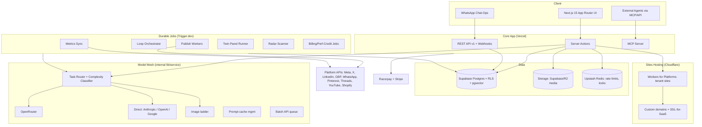
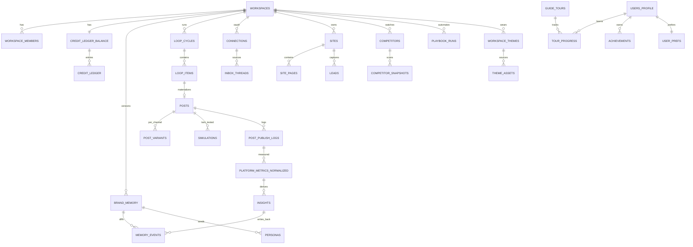

# TSD — SAHODA LABS · AI Marketing OS
**Technical Specification Document · v3.0 FINAL · Companion to PRD/FSD v3.0** *(also serves as the SDD / System Design Document)*
Defines architecture, stack, data model, and engineering standards. Where the v1 reference architecture was sound we keep it; deltas are called out explicitly.

---

## 1. Architecture Overview

**Key deltas vs. the v1 codebase:** (1) durable job platform replaces naive `/api/cron/*` routes; (2) Model Mesh with direct-provider bypass removes the OpenRouter single point of failure; (3) real multi-tenant edge hosting replaces the simulated Netlify deploy; (4) pgvector added for Brand Brain; (5) double-entry credit ledger replaces the simple wallet; (6) dual payment rails from day one; (7) no local-JSON "demo mode" in production code paths (demo = seeded staging environment instead — removes an entire class of split-brain bugs).

## 2. Stack Decisions

| Layer | Choice | Rationale / delta vs Sahoda |
|---|---|---|
| Web framework | Next.js 15 App Router + TypeScript + Tailwind + shadcn/ui | Keep Sahoda's core; upgrade version; shadcn for velocity + consistency |
| Auth | Clerk (orgs, invites) | Keep — org model maps to workspaces; revisit Supabase Auth at scale for cost |
| DB | Supabase Postgres + **RLS** + **pgvector** | Keep RLS multi-tenancy (defense-in-depth); pgvector powers Brand Brain retrieval; index every RLS-referenced column |
| Media storage | Supabase Storage (start) → Cloudflare R2 (scale) | R2 zero-egress matters once media volume grows |
| Jobs/workflows | **Trigger.dev** (or Inngest) | Durable runs, retries, idempotency keys, cron, fan-out, human-in-loop waits — exactly what Loop/Publish need; naive cron routes were v1's weakest link |
| Cache/locks/rate-limit | Upstash Redis | Serverless-friendly; token buckets per workspace + per platform app |
| AI gateway | **Model Mesh** (ours) over OpenRouter **plus** direct Anthropic/OpenAI/Google SDKs | Breadth of OpenRouter, survivability of direct keys; §4 |
| Sites hosting | **Cloudflare Workers for Platforms** + SSL-for-SaaS | Real deploys, per-tenant isolation, custom domains, cheap at scale; kills the fake-deploy problem |
| Payments | Razorpay (UPI AutoPay, INR) + Stripe (global) behind one BillingService | India-first requirement; v1 deferred this |
| Email | Resend | Keep |
| WhatsApp | WhatsApp Business Cloud API (via BSP if needed) | Chat-Ops backbone |
| Observability | OpenTelemetry + Sentry + per-call AI cost log | Margin engine depends on telemetry |
| Validation | zod everywhere (inputs, AI structured outputs, webhooks) | Keep, extend to LLM outputs |
| Renderer (Studio) | Satori/ResVG + node-canvas service | Owning creative rendering enables Remix + zero-COGS exports |
| Theming | CSS variables (OKLCH) + Tailwind tokens; `culori` for color math | Brand Skin: runtime per-workspace theming, WCAG contrast math, auto dark variant (§17) |
| Guide engine | In-house spotlight/tour runtime (driver.js-inspired) + Rive mascot | Cursor-gaze mascot + Do-It-For-Me need custom control; Rive state machine animates the character (§18) |

**Monorepo layout:** `apps/web` (Next.js) · `apps/jobs` (Trigger.dev tasks) · `apps/mcp` · `packages/db` (schema, migrations, RLS tests) · `packages/mesh` (AI) · `packages/publishing` (adapters + Constraint Engine) · `packages/billing` · `packages/render` · `packages/shared` (zod contracts).

## 3. Multi-Tenancy & Security

- **Tenancy:** every domain table carries `workspace_id`; RLS policy = membership subquery on `workspace_members` (indexed); service-role used only inside jobs, never from client-reachable code. RLS tests run in CI from an anon-key client (SQL-editor tests bypass RLS and are banned as evidence).
- **Token vault:** OAuth tokens AES-256-GCM envelope-encrypted; data keys wrapped by a KMS master key (or `SUPABASE_VAULT`); plaintext only in job memory; scopes + expiry stored alongside; rotation runbook (v1's SECURITY_NOTE upgraded to procedure + quarterly drill).
- **Secrets:** per-env via platform secret stores; no `.env` in repo beyond `.env.example`; CI secret-scanning gate.
- **Job auth:** internal job endpoints signed (HMAC + timestamp) — replaces bare `CRON_SECRET`.
- **API keys (public API):** hashed at rest (SHA-256 + salt), prefix-identifiable (`mk_live_…`), scoped (read/write per module), per-key rate limits, last-used tracking, one-click revoke.
- **Abuse controls:** per-workspace AI spend caps (hard stop + alert at 80%), content brand-safety classifier pre-publish, WhatsApp template compliance, upload AV scan + MIME sniffing.
- **Privacy:** PII minimization in logs; data export + deletion (30-day grace) jobs; DPDP (India) + GDPR-aligned processing register.

## 4. Model Mesh (AI subsystem)

**Goals:** right model per task, survivable, cheap, measurable.

**Routing tiers:**

| Tier | Model class (examples, re-pin at build) | Used for |
|---|---|---|
| Nano | Gemini Flash-Lite / Haiku-class small | Twin personas, classifiers, guardrails, hashtags |
| Economy | Gemini Flash / Haiku | Captions, variants, replies, Playbooks |
| Standard | Claude Sonnet-class | Campaigns, Loop planning, site edits, blog, CMO report |
| Premium | Opus/GPT-5-class | Site generation, deep strategy (rare, budgeted) |
| Research | Perplexity Sonar-class | Onboarding research, Radar |
| Image ladder | cheap→premium image models by brief complexity | Studio/media |

**Complexity classifier:** nano-model (or heuristic first: token count, task type, entropy of request) decides tier per call; overrides allowed per task config in `ai_model_routes` (DB-driven like v1 — keep that idea).

**Fallback chain (per tier):** primary provider → alternate provider (direct SDK) → degraded tier with user notice → typed error (never silent low-quality mock in production; v1's mock-fallback is confined to local dev). Circuit breaker per provider (Redis) with 60s half-open probes.

**Cost & margin instrumentation:** every call writes `ai_provider_logs {task, tier, provider, model, tokens_in/out, cached_tokens, cost_usd, latency_ms, credits_charged, workspace_id}` → nightly rollup → margin dashboard + auto-alert if any action's 7-day blended margin < target (feeds PRD §7.3 repricing rule).

**Prompt architecture:** system prompt = static contract per task; **Brand Brain context block = cache-controlled prefix** (provider prompt caching; refreshed on Brain version bump); user payload last. Structured outputs enforced with zod schemas + one repair retry; JSON-mode where supported.

**Batch lane:** Loop create/test, Radar, insights, calibration run via provider Batch APIs (≈50% cost) with 4h SLA; interactive lane bypasses batch.

**Eval harness:** golden-set per task (30–100 cases) scored on schema-validity, brand-voice match (embedding similarity to Brain voice), factuality checks for research; runs on model/prompt change; blocks deploy on regression >5%.

## 5. Brand Brain

**Storage:** hybrid — structured JSONB + relational + vectors.
- `brand_memory (workspace_id, version, status[active|draft], payload jsonb, created_by[user|system], created_at)` — payload sections: identity, voice (do/don't, exemplar lines), offers, products, personas, hooks_library, taboo_topics, learnings[].
- `memory_events (id, workspace_id, source[insight|user|calibration], diff jsonb, status[pending|accepted|rejected|auto], evidence_refs, created_at)` — the writeback queue (FSD M1).
- `brand_embeddings (workspace_id, kind[voice_exemplar|winning_post|product], ref_id, embedding vector(1536), meta)` — pgvector, HNSW index; retrieval for generation grounding + voice-match eval.

**Writeback pipeline:** Measure insights job → propose `memory_events` → user accepts (or auto at L3) → new `brand_memory` version → cache prefix invalidated → embeddings updated. All diffs revertible (append-only versions).

## 6. Audience Twin

- `personas (id, workspace_id, brain_version, profile jsonb, weights jsonb)` regenerated on major Brain bumps.
- **Run:** Trigger.dev task fans out persona×variant evaluations to nano tier (batched, 10 personas/prompt to amortize tokens) → aggregate scorer → `simulations (id, subject_type/id, score, objections, variant_ranking, confidence, cost)` → attach to post.
- **Calibration:** monthly job joins `simulations` × `platform_metrics_normalized` percentiles → per-channel regression → update `weights` → publish MAE to Twin-accuracy page. Guard: refuse "guarantee" phrasing in UI copy (lint rule on strings).

## 7. Loop Orchestration

Trigger.dev durable workflow `loop.cycle(workspace_id, iso_week)`:
- Steps map 1:1 to FSD M2 stages; each step idempotent (`cycle_id` scoped), resumable, with per-step retries.
- **Human-in-the-loop:** L2 uses `wait.forToken` pattern — workflow pauses until approval webhook (app/WhatsApp) or TTL; expiry path marks items expired.
- **Budget enforcement:** cost preview computed from canonical price table before create stage; L3 trims briefs to fit `weekly_credit_budget`.
- Tables: `loop_cycles (id, workspace_id, iso_week, status, plan jsonb, budget, spent, report jsonb)` · `loop_items (id, cycle_id, brief jsonb, post_id, twin_score, status)`.
- Kill switch = cancel workflow run + cascade-cancel scheduled publishes + release credit holds (single transaction + queue cancels).

## 8. Publishing Layer & Sites Hosting

**Adapters (`packages/publishing`):** one interface `publish(payload) → {platform_post_id, permalink}` + `fetchMetrics(connection, since)`; per-platform module (meta, x, linkedin, gbp, whatsapp, pinterest, threads, youtube, shopify). **Constraint Engine** = declarative per-platform spec (max chars, media specs, link policy, rate ceilings, extra-credit surcharges e.g. X link posts) consumed by editor validation AND adapter formatting — one source of truth.
**Delivery:** publish jobs keyed `post:channel:scheduled_at` (idempotent); platform rate limits enforced via Redis token buckets per app + per connection; retries 3× expo backoff on 5xx/timeouts; permanent-fail classification table per platform error code.
**Sites:** generation output = section tree (JSON) + compiled static bundle → uploaded to Cloudflare Workers for Platforms dispatch namespace (per-tenant worker/asset KV) → `slug.sahoda.site` route; custom domains via Cloudflare SSL-for-SaaS (CNAME + cert issuance status polling). Rollbacks: keep last 5 bundles per site. Form submits POST to core API (Turnstile anti-spam) → `leads`.

## 9. Data Model

**Domains & principal tables** (inherits v1's ~60-table map; additions in bold):
- Identity/Tenancy: workspaces, workspace_members, workspace_invites, users_profile, **client_links** (agency approval links)
- Brand: brand_assets, research_reports, **brand_memory**, **memory_events**, **brand_embeddings**, products_services
- Content: posts, post_variants (**replaces post_platforms**, stores per-channel body), post_media, post_publish_logs, hashtags, media_library
- Loop/Campaigns: **loop_cycles**, **loop_items**, campaigns, campaign_posts
- Twin: **personas**, **simulations**
- Sites: sites, site_pages, site_sections, site_deployments, site_domains, site_forms, **leads**, **site_events**
- Engage: connections, inbox_threads, inbox_messages, **reviews**
- Radar/Playbooks: **competitors**, **competitor_snapshots**, **playbooks**, **playbook_runs**
- AI: ai_model_routes, ai_provider_logs, ai_generations
- Billing/Credits: plans, subscriptions, invoices, **credit_ledger** (double-entry), **entitlements**
- Analytics: platform_metrics_raw, platform_metrics_normalized, **insights**
- Ops: audit_logs, error_logs, notifications, api_keys, webhooks_out, app_settings
- Experience: **workspace_themes**, **theme_assets**, **guide_tours**, **tour_progress**, **achievements**, **user_prefs**

**Credit ledger (double-entry):** `credit_ledger (id, workspace_id, entry_type[GRANT|DEBIT|HOLD|RELEASE|TOPUP|PERF_REWARD|EXPIRE|ADJUST], amount, balance_after, action_type, object_ref, model_tier, cogs_usd_est, idempotency_key unique, created_at)`; balance = materialized per-workspace row updated in the same transaction (`FOR UPDATE`), Postgres function `apply_ledger_entry()` (evolves v1's `deduct_credits_atomic`). Rollover/expiry handled by monthly job writing GRANT/EXPIRE pairs.

## 10. Billing Service

One `BillingService` interface; providers: RazorpayProvider (UPI AutoPay mandates, cards) + StripeProvider. Webhooks: signature-verified, **idempotency table keyed by event ID**, state machine `subscriptions.status ∈ {trialing, active, past_due, grace, suspended, canceled}`; plan change → entitlement recompute + prorated ledger GRANT/ADJUST; GST invoice generation job (PDF via render service); dunning schedule per FSD M12. Entitlements resolved from `entitlements` (plan → limits: channels, sites, seats, twin size, loop level, api access) and cached per request.

## 11. Observability & Cost Governance

OpenTelemetry traces across web→jobs→mesh (trace ID surfaced in user-facing errors); Sentry for exceptions; structured logs (no PII). Dashboards: publish success rate, job retry rates, AI latency p95 per tier, **blended margin per action per day**, credit burn vs plan, Twin MAE, provider error rates (circuit-breaker state). Alerts: margin < target, publish failures >2%/h, provider breaker open >5 min, webhook lag, ledger imbalance (sum(entries) ≠ balance → page immediately).

## 12. Testing Strategy

- **Unit:** Constraint Engine specs, ledger function (property-based: no negative balances, idempotent replays), zod contracts.
- **RLS suite:** cross-tenant read/write attempts via anon client per table — CI-blocking.
- **Adapter contract tests:** recorded fixtures per platform + sandbox accounts where available; error-classification table covered.
- **Concurrency:** parallel debits vs single balance (pgTAP/pg-test); duplicate publish jobs → single platform post (idempotency).
- **Workflow tests:** Trigger.dev run replays for Loop happy path, approval-timeout, kill switch, budget trim.
- **AI evals:** §4 harness in CI on prompt/model change.
- **E2E:** Playwright golden paths (onboard→first publish; approve via WhatsApp webhook stub; buy top-up).
- **Load:** k6 on publish fan-out (1k posts/5 min) + metrics sync.
- **Theming:** property tests — 10k random extracted palettes ⇒ 100% of required token pairs pass WCAG AA after the Readability Guard; visual regression on 12 themed key screens; dark-variant checks.
- **Guide:** CI anchor-integrity (every step anchor in every active tour must exist in the build — fails otherwise); DIFM guard tests (spend/publish steps always gated, forbidden routes blocked); tour resume/replay E2E; reduced-motion + screen-reader mode snapshots.

## 13. Public API & MCP

**REST v1** (`/api/v1`): auth `Authorization: Bearer mk_…`; resources: posts (CRUD+schedule), campaigns, sites, leads, metrics (read), credits (read), webhooks-out (post.published, lead.created, cycle.completed — HMAC-signed). Rate limit 120 rpm/key default. OpenAPI spec published; errors follow FSD taxonomy.
**MCP server:** tools mirroring API (create_post, schedule_post, run_twin_test, get_cmo_report, list_leads, generate_site_section); resources: brand_memory (read), metrics summaries; OAuth-scoped per workspace; spend-capped like any actor; all agent actions audit-logged with `actor=mcp:<client>`.

## 14. NFR Targets

| Area | Target |
|---|---|
| Editor interactions | p95 < 400ms (non-AI) |
| Interactive AI (caption) | p95 < 6s |
| Twin run | < 30s (batched) |
| Publish accuracy | fire within ±60s of schedule; ≥99% success (excl. platform-side rejects) |
| Metrics freshness | ≤ 6h |
| Uptime (core) | 99.9% monthly |
| RPO/RTO | 24h PITR / 4h restore drill quarterly |
| Data isolation | zero cross-tenant reads (RLS CI suite) |
| Theme apply | swap <150ms, no reload, WCAG-AA contrast guaranteed on all token pairs |
| Guide overlay | 60fps, runtime bundle <80KB gz (mascot asset ≤300KB cached), zero CLS |

## 15. Build Sequencing (engineering view)

1. **Wk 0–2:** monorepo, DB schema v1 + RLS + ledger fn, Clerk↔workspaces, BillingService (both rails, test mode), app_settings-driven price table.
2. **Wk 2–5:** Model Mesh (tiers, fallback, telemetry, caching), onboarding + research pipeline, Brand Brain v1 + editor.
3. **Wk 4–8:** Post editor + variants + Constraint Engine, Planner, adapters (Meta, X, GBP, WhatsApp), publish workflow + token vault, Measure-lite, Chat-Ops alerts. → **Private beta.**
4. **Wk 8–14:** Loop L0–L2 (workflow + approvals + CMO report), Campaigns, Studio renderer, Sites gen + Cloudflare hosting, credits UI, LinkedIn self-post, **Brand Skin (token system + logo/site extraction + Readability Guard)**, **Guide engine + ~40 core tours**. → **Launch.**
5. **Wk 14–24:** Twin + calibration, Radar, Remix, Playbooks, Engage inbox, custom domains, Agency + white-label, API/MCP, Pinterest/Threads/Shorts, **guideline-PDF extraction, DIFM + stuck-detection, Sandbox brand, milestones, Simple/Pro, release tours**.
6. **Wk 24+:** Loop L3 + guardrail hardening, Shopify, LinkedIn Partner features (pending), scale passes (R2 migration, read replicas).

## 16. Technical Risk Register

| Risk | Sev | Mitigation |
|---|---|---|
| Provider/gateway outage | H | Multi-provider Mesh, circuit breakers, degraded-tier notices |
| Ledger drift under concurrency | H | Single tx `apply_ledger_entry`, invariant monitor + page, property tests |
| Platform API policy shifts (X pricing, Meta review) | H | Constraint Engine config (no code deploy), surcharge credits, channel feature flags |
| WhatsApp template rejections / messaging limits | M | BSP relationship, template library pre-approved, alert throttles |
| Cloudflare tenant-site abuse (phishing) | M | Content scan on publish, abuse reporting, per-tenant kill |
| Twin latency/cost creep | M | Batch fan-out, persona-per-prompt packing, panel size by plan |
| Prompt-cache invalidation bugs → stale brand voice | M | Cache key = brain version hash; eval canary per deploy |
| RLS policy gap on a new table | H | Migration linter: new table without policy fails CI |
| Brand palette yields ugly/illegible UI | M | Readability Guard (WCAG auto-fix), curated fallback pairings, preview-before-apply, per-user default override |
| Tour anchor drift after UI refactors | M | `data-guide` registry + CI anchor-integrity check on every build |
| Mascot fatigue / annoyance | M | Frequency caps (1 proactive offer/day), personality levels, global mute, tours never forced |
| DIFM performs an unintended action | H | Anchor allowlist, spend/publish confirm gates, forbidden screens, ESC abort, `actor=sahoda_difm` audit trail |

## 17. Theming System (Brand Skin)

**Token set:** `{primary, primaryFg, secondary, accent, surface[0..3], text[hi|mid|low], border, success, warning, danger, radius, fontHeading, fontBody}` — stored per workspace in `workspace_themes (workspace_id, version, tokens jsonb, source[default|extracted|manual], diff_log jsonb, status, created_at)`; uploaded guideline files + extracted logo assets in `theme_assets` (Storage refs, AV-scanned).

**Extraction pipeline (Trigger.dev task):** input file/URL → normalize (PDF pages → images via renderer; site → screenshot + stylesheet color harvest) → vision-model structured extraction (zod schema: palette candidates with suggested roles, font names, logo colors, any stated do/don'ts) → role-assignment heuristic (dominant color ≠ background; saturation ranking; brand red/danger disambiguation) → Readability Guard → proposal saved as `status=proposed` for the preview UI.

**Readability Guard algorithm:** convert all colors to OKLCH; for every required pair (text-on-surface, primaryFg-on-primary, border-on-surface, states) compute WCAG contrast; while a pair < target (4.5:1 text, 3:1 UI), binary-search the foreground **lightness L only** — hue preserved, chroma clamped ≤0.15 on large surfaces — until compliant; semantic clamps keep danger in the red hue band, success in green, warning in amber (nearest in-band tone if the brand lacks one); derive the dark variant by surface inversion, then re-run the guard; emit a human-readable `diff_log` ("primary #1A1A66 → #2B2BAA, +contrast 3.1→4.6") that powers the FSD notice. Property-tested: 10k random palettes ⇒ 100% pass.

**Delivery:** SSR inlines `` from the active workspace theme (zero FOUC); the client layers the user's personal override from `user_prefs`; Tailwind utilities map to the CSS variables; **scope flags** gate which renderers consume workspace vars (app shell / site generator default theme / Studio templates / report PDFs / client approval pages). Occasion packs are an overlay token layer with an `expires_at`. Theme swap = variable write, <150ms; cached by `workspace_id+version` ETag.

## 18. Guide Engine ("Sahoda")

**Anchor registry:** stable `data-guide="…"` attributes throughout the UI; a build step emits the registry map; CI cross-checks every active tour in `guide_tours` against it (missing anchor = failed build).

**Runtime:** portal-mounted fixed overlay; spotlight = single SVG mask cutout (one repaint layer, zero CLS); bubble positioned via floating-ui with collision handling; step controller is a small state machine (`idle → step(n) → waiting_action|waiting_next → done|paused`); required-action detection via delegated listeners on the anchor; smooth `scrollIntoView` with header offset. Lazy-loaded route-level chunk (<80KB gz), never in the critical path.

**Mascot:** Rive character (~300KB, cached, lazy) with state-machine inputs `{gazeX, gazeY, pose: idle|look|walk|point|celebrate}`; cursor tracking rAF-throttled to 30fps and disabled off-screen or under `prefers-reduced-motion`; walk-to-target = 400ms translate along a simple path.

**DIFM executor:** replays a tour's anchors programmatically — synthetic cursor sprite tweens between anchors (~600ms/step), then dispatches real click/input events (typed values previewed first). Guards: allowlisted anchors only; `confirm_spend`/publish steps always pause for a real tap; forbidden routes (`/settings/billing`, `/settings/api-keys`, destructive dialogs) hard-blocked; ESC or any user pointer event aborts within one frame; every executed step writes `audit_logs(actor='sahoda_difm')`.

**Persistence & content:** `guide_tours (id, version, locale, definition jsonb, active, tourable_release_ref)` · `tour_progress (user_id, workspace_id, tour_id, version, step, status, updated_at)` · `achievements (user_id, workspace_id, key, achieved_at, reward_ledger_ref)` · `user_prefs (user_id, theme_override, mode simple|pro, sahoda jsonb {frequency, personality, muted, dnd_hours})`. Tour JSON (FSD Appendix C) is hot-updatable from the DB — no deploy needed for copy or step changes; version bumps gracefully reset progress with a restart offer.

**Stuck-detection service:** client-side heuristics (panel open/close loops, repeated validation errors, long idle on multi-step screens) emit a `stuck_candidate` event → throttled server check (≤1 proactive offer/day/user, suppressed in DND, during approvals, and for Pro-mode users unless erroring) → offer rendered as a small Sahoda bubble, never a modal.

**Telemetry:** `tour_started / step_completed / step_skipped / tour_completed / difm_run / stuck_offer_{shown,accepted}` → per-step funnel dashboard; drop-off >30% on a step flags its copy for review.
