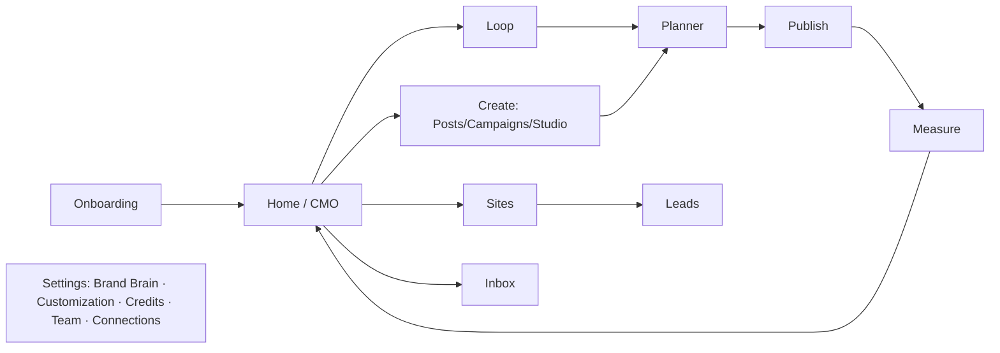

# UX/UI — SAHODA LABS Design System & Screen Spec
**v1.0 · Pairs with 07_Brand_Kit (identity), FSD v3.0 (behavior), TSD §17–18 (implementation)**
These are the app defaults; the Brand Skin feature lets each customer's workspace override the app scope with THEIR brand — our own kit is simply the default theme, built with the same Readability Guard rules we sell.

---

## 1. Design Principles
1. **One brain, one canvas.** Every screen shows work grounded in the Brand Brain; never make the user re-explain their business.
2. **Show, don't configure.** Sahoda demonstrates (tours, Do-It-For-Me) instead of settings sprawl; defaults are opinionated.
3. **Wear the customer's brand.** The interface is a stage for their identity — our chrome stays quiet (Ink + Stone) so Orange and their Brand Skin carry meaning.
4. **Calm autonomy.** Anything that will publish or spend is always visible before it happens: what, when, where, and the exact credit cost.
5. **AA always.** Contrast is enforced by tokens, not by designer discipline. If a pair isn't in the approved table, it doesn't ship.

## 2. Foundations (default theme tokens)
All values sampled/derived from the official brand assets and WCAG-verified (see 07_Brand_Kit §4 for the full math).

### 2.1 Color tokens
| Token | Light | Dark | Use |
|---|---|---|---|
| `--primary` | #FF4B00 | #FF4B00 | Brand actions, identity moments |
| `--primary-fg` | #131313 | #131313 | **Text/icon on primary** (5.54:1 ✓) — primary buttons are Orange with Ink label |
| `--primary-strong` | #D73F00 | #E04200 | Large brand fills where white text is needed (white 4.56:1 ✓) |
| `--accent-text` | #BA3700 (Ember 700) | #FFA580 (Orange 300) | Links, accent copy (5.78 / 9.68 ✓) |
| `--bg` | #FFFFFF | #131313 | Page |
| `--surface-1/2` | #FAFAF9 / #F4F4F3 | #1B1B1C / #232324 | Cards, wells |
| `--ink` / `--text` | #131313 | #F5F5F4 | Primary text |
| `--text-muted` | #525252 (7.81 ✓) | #A3A3A2 | Secondary text |
| `--border` | #E5E5E4 | #2E2E2F | Hairlines |
| `--success/warning/danger/info` | #15803D / #B45309 / #C81E1E / #1D4ED8 | tints 300 on dark | All ≥5:1 on white; **danger is crimson, never brand orange** |

Hard rules: Orange 500 is never body text on light (3.36:1); white on Orange 500 only ≥19px semibold (UI/large 3.36 ✓); everything smaller on orange uses Ink.

```css
:root{--primary:#FF4B00;--primary-fg:#131313;--primary-strong:#D73F00;--accent:#BA3700;
--o50:#FFF2ED;--o100:#FFE4D9;--o200:#FFC9B2;--o300:#FFA580;--o400:#FF763D;--o500:#FF4B00;
--o600:#E04200;--o700:#BA3700;--o800:#962C00;--o900:#782300;--o950:#521800;
--bg:#FFFFFF;--s1:#FAFAF9;--s2:#F4F4F3;--ink:#131313;--muted:#525252;--border:#E5E5E4;
--success:#15803D;--warning:#B45309;--danger:#C81E1E;--info:#1D4ED8;
--radius:12px;--radius-input:10px;--radius-pill:999px}
```

### 2.2 Typography
| Role | Face | Size/leading | Weight | Notes |
|---|---|---|---|---|
| Display H1 | **Garet** | 40/44, tracking −1% | 800 | Hero numbers, page titles, CMO headline |
| H2 / H3 | Garet | 32/38 · 24/30 | 700 | Section heads |
| Body | **Outfit** | 16/24 | 400/500 | Workhorse UI (Google Fonts, variable) |
| Secondary / caption | Outfit | 14/20 · 13/18 | 400 | Meta, helper text |
| Buttons/labels | Outfit | 14–16 | 600 | Sentence case |
| Numbers (credits, money) | Outfit tabular-nums | — | 600 | Always tabular |
| Code | JetBrains Mono | 13/20 | 400 | Advanced mode |
Fallback stack: `Outfit, Inter, system-ui`. Hindi pairing: Noto Sans Devanagari. Helvetica (from the brand fonts folder) is the print/corporate alternate — license required; never assumed on web.

### 2.3 Space, shape, elevation, motion, icons
4pt spacing grid; content max-width 1200. Radius: inputs 10, cards 12, primary CTA + credit chip = pill. Borders 1px `--border`; exactly two shadow levels (card `0 1px 2px 6%`, popover `0 8px 24px 12%`). Motion: 150ms micro / 250ms panel, easing `cubic-bezier(.2,0,0,1)`; signature **blade-sweep** page transition (an Orange blade wipes 250ms on route change); milestone confetti in Orange 300/500 + Ink only; full `prefers-reduced-motion` support. Icons: Lucide, 1.5px stroke, 20px default — echoes the geometric brand.

## 3. App Shell & Information Architecture
**Left rail** (72px icons, expandable 240px): Home · Loop · Create (Posts / Campaigns / Studio) · Planner · Sites · Inbox · Measure · Radar° · Playbooks° · Connections · Settings (° = Growth+). **Top bar:** workspace switcher (Agency: client dropdown) · ⌘K command palette · **credit chip** (pill, live balance, click = wallet) · notifications · avatar. **Sahoda dock:** bottom-right, 96px idle, never overlapping primary CTAs.



## 4. Key Screens (purpose → layout → primary action → states → tour hook)
**4.1 Onboarding.** Full-bleed split: left = 6 wizard steps; right = live preview card (a sample post + mini-site) that **re-themes instantly at the Look & Feel step** — the "the app is already mine" moment. Progress dots, autosave, ≤10 min. Research runs async with a progress card; user may proceed. Tour: none (the wizard IS the tour); Sahoda greets at step 1.
**4.2 Home / CMO.** Hero = Monday CMO card: last week in one sentence, top & bottom post thumbnails, one Learning chip ("Carousels beat singles 2.1× — add to Brain?" Accept/Reject), this week's plan list with **Approve week** primary. Secondary row: channel sparklines, credit burn vs budget. Empty state: Sahoda intro + "Plan my first week."
**4.3 Posts editor.** Three panes: left = media & library; center = canvas (title/body, inline AI actions on selection); right drawer = channel tabs with per-platform variant, live limit meters from the Constraint Engine, and Twin score badge. Bottom bar: schedule (best-time suggested) + honest cost preview ("Publish to 4 channels · 3 credits"). Over-limit blocks only that channel with a fix-it CTA.
**4.4 Planner.** Calendar ⇄ Kanban toggle; chips colored by status (Draft Stone / Review Amber / Scheduled Orange-200 / Published Success / Failed Danger); approval lane pinned; drag = reschedule with conflict toast; day peek popover.
**4.5 Campaigns.** Prompt hero + config row → skeleton "generating" state with stage captions → tabs (Overview / Posts / Creative / Scripts); per-post expand-to-edit; primary **Add to Loop**, secondary Add all to Planner (idempotent).
**4.6 Sites builder.** Left = section list (drag/reorder/add); center = live iframe with breakpoint toggle; right = chat edit ("Make the hero about the Diwali offer") showing a **diff preview** before apply (3 cr). Publish button returns the real URL instantly; domain status inline. Advanced mode tucks behind a code icon.
**4.7 Inbox.** Three panes: filters+threads / conversation / context (profile, order history if Shopify, prior replies). AI draft appears inline with tone chips (Warmer / Shorter / Firm); explicit Send; SLA ring on threads; reviews get star context + template chips.
**4.8 Settings → Credits.** Wallet hero number (tabular, huge, Garet); ledger table where every row's "why" popover shows action, object link, model tier; spend-cap slider with 80% alert toggle; 3-tap top-up sheet; Performance Credits earned shown with the winning post linked.
**4.9 WhatsApp approval card (spec).** Image preview + first 80 chars + Twin score + schedule time; buttons Approve / Edit (deep link) / Skip; batch card "Approve all 5" lists thumbnails. Copy ≤ 2 lines; never more than one card per cycle unless replied.
**4.10 System states.** Skeletons, never spinners >400ms; every empty state = one primary action + one Sahoda tip; error pattern = what happened → what we did (e.g., "we didn't charge you") → one action + trace ID.

## 5. Sahoda Mascot — Art Direction
Built **from the logo itself**: body = one brand blade (Orange 500, 2px Ink outline), the notch becomes the eye socket (white sclera + Ink pupil that tracks the cursor); at idle the mascot's second blade folds in so the resting pose *is* the double-blade mark. Poses: idle (breathing 4s loop) · look (gaze tracks) · walk/point (blade tips toward target) · celebrate (both blades up + confetti). Sizes 64/96/128px; speech bubble = Ink bg, white text, radius 12, blade-shaped tail; personality levels change copy only, never motion intensity. Delivered as a Rive file with state-machine inputs {gazeX, gazeY, pose} per TSD §18; static SVG fallback for reduced-motion.

## 6. Component Map (shadcn/ui base)
| Component | Spec |
|---|---|
| Button | primary = Orange 500 bg + **Ink** label (pill); secondary = Ink outline on Paper; ghost = Ink text; destructive = Crimson; loading = blade micro-spinner |
| Credit chip | pill, Orange border, tabular number, pulses once on change |
| Tabs / Sheet / Dialog / Command(⌘K) | shadcn defaults, tokens applied; dialogs max 480px |
| DataTable | 13px meta row, sticky header, row hover Stone-1 |
| Calendar | custom chips per §4.4 |
| Toast (sonner) | bottom-left, Ink bg, 4s, action slot |
| Badge | status colors from semantic set only |
| Tour overlay | per FSD M14: 65% dim, cutout + 2px Orange pulse ring |

## 7. Content & Voice in UI
Sentence case everywhere. Buttons start with verbs ("Approve week", "Publish site"). Numbers are stated plainly and honestly ("Uses 6 credits", "Predicted score 72 — not a guarantee"). Sahoda speaks first-person, short, warm-direct ("I've planned your week. Two posts need your eyes."). Hindi parity is a release requirement, not a translation pass. Error copy never blames the user.

## 8. Responsive & Platforms
App is desktop-first (min 1024px full experience); tablet = full; **phone = supervise subset** (Home/CMO, approvals, Planner view, Inbox, wallet) — creation happens on desktop or via WhatsApp commands. Generated customer Sites are fully responsive always. PWA install for the supervise subset.

## 9. Accessibility Checklist
Focus ring 2px Ember 700 (light) / Orange 300 (dark), offset 2px · full keyboard paths incl. tour overlay (Tab/Enter/Esc per FSD M14) · ARIA live regions for generation progress and credit changes · reduced-motion swaps blade-sweep for fade and freezes mascot · screen-reader tour mode = numbered checklist · all charts include data-table toggle · touch targets ≥44px on phone views.

## 10. Handoff
Tokens ship as the CSS variables above (mirrored in TSD §17 `workspace_themes` default row). Figma library structure: 01 Foundations (tokens, type, grid) / 02 Components (mapped 1:1 to §6) / 03 Patterns (states, tours, cards) / 04 Screens (§4, light+dark) / 05 Mascot (poses, bubble) — file naming `SL-{page}-{screen}-{state}`. Any new color pair enters via the Readability Guard script (contrast-verified) or it doesn't enter at all.
