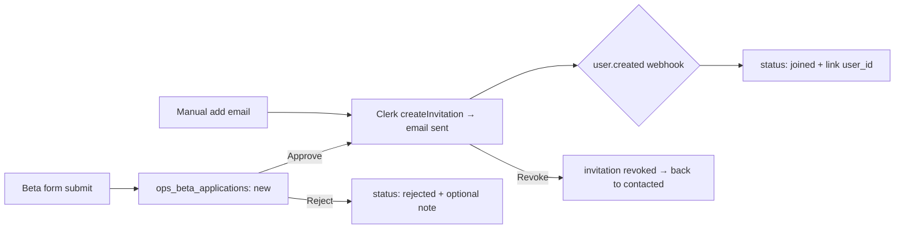
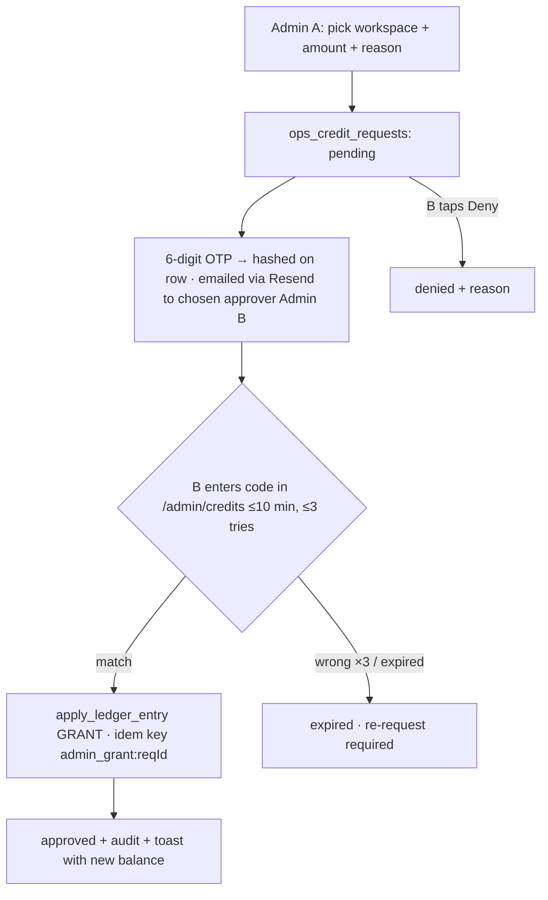

# Admin Ops — SAHODA LABS · Admin Panel + Dev Ops Dashboard (`/admin`)
**13 · v1.0 · Implementation-canonical for everything under `/admin`.**
Two halves, one surface: **ADMIN** (invite-only access, beta applications, credit allocation, team) and **DEVOPS** (roadmap progress, changelog, scrum, QA) — the second half is fed **automatically by Claude Code while it works**. Behavior here; tokens/components still from 08; canon order in 00_README applies (add this file as row 13 there).

**Roles for the build:** Claude Code acts as **Project Manager + QA Lead** for the whole repo from the moment this ships — every session updates the board, changelog, and QA console as a side-effect of normal work (protocol in §9). Manual edits are always possible; automation is the default.

---

## 0. Placement & canon
- Add to `00_README` pack table: `| 13 | Admin Ops | /admin panel + Claude-Code-fed dev dashboard | Before building /admin |`
- Canon: 05 still owns timing · 02_FSD owns product behavior · **13 owns `/admin` behavior** · 03_TSD owns architecture (this doc extends its data model with `ops_*` platform tables) · 08 owns every token.
- `/admin` is an **internal, platform-scope** surface: desktop-first, default theme only (Brand Skin never applies here), English only, no credits charged for anything inside it.

## 1. Scope (v1 — all of it ships)
**ADMIN:** A1 invite-only signup approvals (Clerk) · A2 embeddable beta/early-access form + inbox · A3 credit allocation with two-admin OTP approval · A4 team & roles.
**DEVOPS:** D1 roadmap progress card (full-width) · D2 changelog with auto-cycling author · D3 scrum board (4 columns, auto-driven) · D4 QA console (auto + manual, screenshots, autosave, JSON in/out) · D5 live "Claude is working" session strip + gates strip (added by PM discretion).
**Out of v1:** tenant impersonation, GitHub PR widgets, analytics charts on ops data, mobile layout (read-only mobile is a later nicety).

## 2. Access model
- **Clerk instance → Restricted mode.** Nobody signs up without an invitation. Two entry paths: (a) admin approves a beta application → Clerk invitation email; (b) admin adds an email directly → same invitation API. Revoking an invitation is one click. `user.created` webhook links the new Clerk user back to its application row (status → `joined`).
- **`/admin` gate:** Clerk session **and** membership in `ops_admins` (status `active`). Enforced in `middleware.ts` for `/admin/*` and in every `/api/admin/*` handler (defense in depth — UI check is never the only check). Non-admins get a plain 404, not a login upsell.
- **Roles:** `owner` (everything + manage admins) · `admin` (everything except manage admins) · `viewer` (read-only; no approve/grant/edit). First owners seeded from `ADMIN_BOOTSTRAP_EMAILS` env at first boot.

## 3. Data model (platform tables — TSD §9 amendment)
**Amendment to the sahoda-db rule:** `ops_*` tables are **platform-scope** and are the *only* sanctioned exception to "every table carries workspace_id." They MUST still: enable RLS, expose `SELECT` only via `is_ops_admin()` (security-definer fn checking `ops_admins` by `auth.uid()`), take all writes through server actions / service-role, and ship an anon-client RLS test proving outsiders read nothing. Add this paragraph to `.claude/skills/sahoda-db/SKILL.md` in the same PR that creates the tables.

| Table | Key columns (beyond id/created_at/updated_at) |
|---|---|
| `ops_admins` | user_id (Clerk id), email, name, role owner\|admin\|viewer, status active\|revoked |
| `ops_beta_applications` | name, business_name, email (citext, unique-open), phone, source_url, status new\|contacted\|invited\|joined\|rejected, clerk_invitation_id, notes, handled_by |
| `ops_credit_requests` | workspace_id, workspace_label, amount int>0, reason, requested_by, approver_id, otp_hash, otp_expires_at, attempts int, status pending\|approved\|denied\|expired, ledger_idempotency_key |
| `ops_roadmap_items` | code (e.g. `A1`,`B7`), stage, title, weight int (default 1), status todo\|active\|done\|cut, target_date, sort |
| `ops_tasks` | code (`SL-###`), title, detail, doc_ref, roadmap_code, column todo\|in_progress\|review\|done, assignee claude\|divas\|girija\|both, blocked bool, blocked_reason, pr_ref, commit_sha, started_at, review_at, done_at, moved_by claude\|human, sort |
| `ops_changelog` | seq bigserial, title, summary_plain (non-technical, mandatory), details_tech, kind added\|changed\|fixed\|removed\|security\|docs, author (auto-cycled §6), task_codes text[], tourable bool default false, happened_at |
| `ops_qa_runs` | task_code, kind auto\|manual, suite typecheck\|lint\|unit\|rls\|smoke\|e2e\|manual, status pass\|fail\|blocked\|running, summary_plain, details, actor, started_at, finished_at |
| `ops_qa_artifacts` | run_id, storage_path, caption, bytes, mime |
| `ops_sessions` | session_id, label, started_at, last_heartbeat_at, tasks_touched text[], status working\|idle\|ended |
| `ops_audit_log` | actor, action, target_table, target_id, meta jsonb |

Storage: private bucket `qa-artifacts` (`qa/{run_id}/{uuid}.{ext}`, ≤10 MB, png/jpg/webp; signed upload + signed read URLs only). All zod row schemas live in `packages/shared/ops.ts` — apps never redefine.

## 4. A1 · Invite-only access (Clerk approvals)

Rules: approve/reject/revoke are `admin`+ actions, all audit-logged; duplicate email with an open application → merged, not duplicated (unique-open constraint); rejected emails may re-apply after 30 days; every state change can fire a Resend email using a plain, warm template (copy: sentence case, no marketing fluff). New-application notifications go to all active admins (email; digest if >5/hour).

## 5. A2 · Embeddable beta / early-access form
- **Fields (exact):** Name · Business name · Email · Phone. Nothing else in v1; one screen; verb-first submit ("Request early access"); success state = one sentence + no redirect.
- **Embed contract:** public route **`/embed/beta`** — minimal page, default theme tokens, no app chrome, `frame-ancestors *` for this route ONLY (every other route stays DENY). Snippet given to any landing page:
```html
<iframe src="https://app.sahodalabs.com/embed/beta?src=SITE_TAG"
        style="width:100%;max-width:440px;height:460px;border:0" loading="lazy"></iframe>
```
  `?src=` lands in `source_url` so we know which landing page converts. Optional `embed.js` (auto-resize via postMessage) is a nice-to-have, not a blocker.
- **Anti-abuse:** Cloudflare Turnstile (same keys as Sites forms) verified server-side + Upstash rate limit (5/min/IP, 20/day/IP) + honeypot field + zod validation (email format, phone 7–15 digits, lengths). Submissions insert server-side via service role — there is **no** anon-insert RLS path.
- Submissions appear in `/admin/applications` (the inbox) in realtime, with search, status filters, per-row Approve / Reject / Add note, and CSV export.

## 6. A3 · Credit allocation with two-admin OTP (maker-checker)
"Any admin can request; a **different** admin's code confirms." This is the 2FA the founder asked for, done as maker-checker so no single account can mint credits.

Rules: approver must be a different active `admin`/`owner` than the requester (env `OPS_ALLOW_SELF_APPROVE=true` permits self-approve **in dev only** and stamps the row `self_approved`); grant goes through `apply_ledger_entry()` exactly once (idempotency key = request id — a retry can never double-grant); `action_type='admin_grant'`, `object_ref=request.id`, visible in the customer's wallet "why" as "Credits added by Sahoda Labs team"; workspace picker = server-side search by name/slug/owner-email (service role, read-only); amounts capped at 10,000/request; everything audit-logged. Negative adjustments are out of v1 (do them in SQL with two humans present).

## 7. D1 · Roadmap progress card (full-width, top of `/admin/dev`)
- **Data:** `ops_roadmap_items`, seeded once from Roadmap 05 (Alpha items 1–14 as stage `alpha`, backlog 1–20 as stage `backlog-N`, plus stage `admin-ops` for this build) and thereafter maintained by Claude via the sync protocol (§9) — statuses flip as linked tasks complete.
- **Shows:** current stage name + a % bar (`Σweight(done)/Σweight(total)`, tabular-nums) · **days remaining** = `target_date − today` (amber ≤3, crimson overdue, "no target" if unset) · stage dots done/active/todo · **"To reach Done"** — a computed checklist: open roadmap items in the current stage (by sort) + any red gates (§ D5) + any `blocked` tasks, each linking to its scrum card. That list *is* the answer to "what should be done to get to done."
- One primary action: "Open board." Card is read-mostly; editing items happens in a side sheet (admin+).

## 8. D2 · Changelog (non-technical first, author auto-cycle)
- **Entry anatomy:** `title` (≤80) · `summary_plain` — mandatory, written for a non-technical product owner ("You can now…", "Fixed a bug where…", no jargon, no file paths) · optional `details_tech` behind a "Technical details" disclosure · kind badge (semantic colors per 08 §6) · date+time (IST, `24 Jul 2026 · 14:32`) · linked task codes · author chip.
- **Author cycle (exact):** `authors = ['DIVAS','GIRIJA','DIVAS AND GIRIJA']` → `author = authors[seq % 3]` assigned **server-side** at insert from the global sequence, so the rotation is deterministic no matter who/what writes the entry. Manual override allowed per-entry; overrides don't shift the cycle.
- **Copy affordances:** per-entry copy (plain + markdown) · "Copy day" · "Copy since last copy" (watermark stored per admin) — clipboard-first because these get pasted into WhatsApp/investor notes.
- **Feeds:** Claude writes an entry at every `/ship` and any user-visible change (§9); humans can add entries in a 3-field sheet. Entries flagged `tourable` are the future M15 release-tour source — flag exists now, engine later.

## 9. D3+D4+D1 feeder · The Claude Code ↔ Dashboard sync protocol ⚙️ (the core of this doc)
**Principle:** the repo is the source of truth; the dashboard mirrors it in near-realtime. Claude never "remembers to update the dashboard" — hooks make it a side-effect.

1. **State dir `ops/state/`** (committed): `roadmap.json`, `board.json`, `changelog.pending.json`, `qa.pending.json` — all zod-typed from `packages/shared/ops.ts`. Claude edits these small files as part of normal work; they are reviewable in every PR like any code.
2. **Sync script `scripts/ops-sync.mjs`:** reads state files + git context (branch, last commit subject/sha) → POST `/api/admin/devops/ingest` with header `x-ops-token: $DEVOPS_INGEST_TOKEN`. Idempotent by client-generated ids (safe to fire repeatedly); non-2xx **never blocks work** — prints one warning line, exits 0. Consumes `*.pending.json` on success (server acked → file emptied).
3. **Hooks (`.claude/settings.json` additions):**
   - `PostToolUse` matcher `Edit|Write|MultiEdit` on paths `ops/state/**` → run sync (state changed → mirror now).
   - `PostToolUse` matcher `Bash` → `scripts/ops-hook-bash.mjs`: if the command was `turbo …|vitest|playwright|tsc|eslint`, parse exit code → append an **auto QA run** (suite inferred, pass/fail) to `qa.pending.json` → sync. If it was `git commit`, scan the message for `SL-###` codes → move those tasks to `done` in `board.json` (+ commit_sha) → sync.
   - `Stop` + `SessionStart` → heartbeat (`ops_sessions` upsert: session id, tasks touched, status) → the live **"Claude is working"** pulse in the header strip; idle >10 min → `idle`, `SessionEnd` → `ended`.
4. **Skill `.claude/skills/sahoda-devops/SKILL.md`** (create verbatim):
```markdown
---
name: sahoda-devops
description: Use in EVERY session — you are also the project's PM + QA Lead. Governs ops/state files, the scrum board, changelog, and QA console under /admin.
---
Board flow (ops/state/board.json): picking up a task → column in_progress + started_at. Output produced and QA (auto or manual) begins → review. Commit referencing SL-### + QA green → done + commit_sha. Never skip review; never move backward without blocked_reason. New work not on the board → add a task first (code SL-next, link roadmap_code).
Changelog: at every /ship or user-visible change append to changelog.pending.json — summary_plain MUST read plain-English for a non-technical owner ("You can now…"), no jargon/paths; author is assigned server-side (never set it).
QA: hooks log auto runs; record manual QA via /qa-log or qa.pending.json {task_code, suite:'manual', status, summary_plain}. A task is not done with a red run attached.
Roadmap: when the last task of a roadmap item is done, set the item done in roadmap.json.
Sync is hook-driven; if hooks are off run `pnpm ops:sync`. Ingest failures never block work.
```
5. **Commands:** `/task SL-12 start|review|done ["note"]` (edits board.json + syncs) · `/qa-log SL-12 pass|fail "plain summary"` · `/log-change "title" "plain summary" [kind]` · extend `/ship`: refuse to finish if the shipped work has no board entry, no changelog entry, or a red QA run.
6. **Server side:** `/api/admin/devops/ingest` (token-only route, constant-time compare, 60 rpm) upserts `ops_*` rows in one transaction, assigns changelog authors, stamps `moved_by='claude'`. Supabase **Realtime** on `ops_tasks/ops_changelog/ops_qa_runs/ops_sessions` → the dashboard updates live while Claude works — the founder literally watches cards slide as the agent codes.
7. **Trust rule:** dashboard rows are *derived*; on conflict, repo/state files win — a `pnpm ops:sync --full` reconciles (server upserts, marks vanished tasks `archived`, never deletes).

## 10. D3 · Scrum board (behavior)
Four fixed columns — **To Do · In Progress · For Review · Done** — matching the lifecycle in §9. Seeding: every open roadmap item spawns its initial task(s) into To Do on first ingest. Cards: code, title, roadmap chip, assignee avatar (Claude blade / D / G / D+G), age in column, blocked ribbon (crimson) with reason, QA dot (green/red/none), commit/PR ref on Done. **Manual control is total:** drag between any columns (writes `moved_by='human'` + optional note), inline add/edit/archive — automation and humans co-drive, automation defaults. Filters: assignee, roadmap stage, blocked. WIP nudge (not a block) when In Progress >5. Column counts in tabular-nums; board virtualizes past 200 cards.

## 11. D4 · QA console (the QA Lead's room)
- **Two feeds, one table:** auto runs (from hooks: typecheck/lint/unit/rls/smoke/e2e with parsed pass/fail + duration) and manual runs (humans or Claude via `/qa-log`). Filter by task, suite, status, actor, date. A red run pins to the top until resolved or superseded.
- **Manual run composer:** task picker → suite `manual` → checklist body (markdown) → status → **screenshots**: drag-drop *and* paste-from-clipboard, ≤10 MB each, thumbnails inline, stored per §3 bucket. **Autosave every 2 s (debounced)** to a server draft — "Saved · 14:32:07" indicator; a closed tab never loses notes; drafts restore on return.
- **JSON export/import:** export = `{schema:'sahoda_qa_v1', exported_at, runs:[…], artifacts:[…meta only…]}` (zod-validated). Import validates against the same schema; upserts by id; conflicts and rejects listed in a result panel, never silently merged. This is the portable QA record the founder asked for.
- **Definition of done linkage:** a task cannot sit in Done with its latest linked run red — the board shows a crimson QA dot and `/ship` refuses (§9.5).

## 12. D5 · Header strips (session + gates)
Top of `/admin/dev`: **Session strip** — Sahoda-blade pulse when any `ops_sessions.status='working'` (heartbeat <2 min), label + tasks touched; grey "Idle since 14:02" otherwise. **Gates strip** — latest auto QA per suite (typecheck · lint · unit · rls · smoke) as green/red chips with age; any red also surfaces in D1's "To reach Done." Zero config — it's all derived from ingested runs.

## 13. A4/D-Team · Team & roles screen
`/admin/team`: table of `ops_admins` (name, email, role, status, last active) · owner-only: invite admin (email → Clerk invitation + `ops_admins` pending→active on join), change role, revoke (kills `/admin` access instantly; Clerk session revoke best-effort) · self-demotion of the last owner is blocked · every change audit-logged. The **changelog author cycle is independent of this table** (fixed trio by product decision §8).

## 14. UI spec (routes + layout)
```
/admin                     → redirect /admin/dev
/admin/dev                 D1 roadmap card (full-width) · D5 strips · D3 board · D2 changelog rail (right, 380px) 
/admin/qa                  D4 console
/admin/applications        A2 inbox (+ CSV export)
/admin/credits             A3 requests + approvals
/admin/team                A4
/embed/beta                public embeddable form (no chrome)
```
Left rail gains an `Admin` item (shield icon) **visible only to ops admins**; inside `/admin` a slim sub-nav (Dev · QA · Applications · Credits · Team). Everything per 08: tokens only, shadcn base, cards `--r-card`/`--sh-card`, status badges from semantic set (blocked/failed = crimson, never orange), skeletons >400 ms, empty states = one action + Sahoda tip ("No applications yet — drop the embed on the landing page."), error states with trace id, focus rings `--acc`, tabular-nums on every number. `/admin` ignores workspace theming by design.

## 15. API surface (all zod-validated, all audited)
`POST /api/public/beta-apply` (Turnstile + rate limit) · `POST /api/admin/devops/ingest` (ops token) · server actions: application approve/reject/revoke/note · credit request create/verify-otp/deny · task move/create/edit/archive · changelog create/edit · qa draft-save/finalize/import/export · artifact sign-upload · team invite/role/revoke · roadmap edit. Clerk webhook: `user.created` → application `joined` + admin activation. No public REST for ops data (internal only; revisit with API v1).

## 16. Security notes (delta to TSD §3)
Ops token: ≥32-byte random, env-only, never client-shipped, constant-time compared, rotate with keys (Companion §10) — worst-case leak = fake board rows (no tenant data, no credits path). Credits path is human-only + OTP + ledger fn (agent ingest **cannot** touch `ops_credit_requests` or the ledger). `/embed/beta` is the only frame-able route; CSP elsewhere unchanged. Phone/email in applications = PII: masked in logs, covered by the standard export/delete jobs. Screenshots bucket private; signed URLs 10-min TTL. RLS tests: anon client must fail to read every `ops_*` table and fail to insert applications directly.

## 17. Acceptance gate (Admin-Ops DoD — all must pass before `/ship`)
☐ Non-admin (and anon) hits `/admin/*` → 404; anon RLS suite green on all `ops_*` ☐ Restricted signup: uninvited email cannot register; approve → invitation → signup works → row `joined` via webhook ☐ Embed form on a foreign origin submits → row appears in inbox in realtime; Turnstile fail + rate-limit paths rejected ☐ Credit flow: A requests, B's OTP approves → wallet +N with correct "why"; replay of same request grants **nothing**; wrong-code ×3 expires; self-approve blocked in prod config ☐ A real Claude session: task moves todo→in_progress→review→done on the live board **without any human touching the UI**; commit with `SL-###` auto-lands Done with sha ☐ Gates strip mirrors a real failing test as red, then green after fix ☐ Changelog authors run DIVAS→GIRIJA→DIVAS AND GIRIJA over three consecutive entries; copy buttons yield clean plain+md ☐ Manual QA run with pasted screenshot survives a tab kill via autosave; JSON export→wipe→import restores byte-identical runs ☐ Roadmap card % , days-remaining, and "To reach Done" all recompute after a task completes ☐ `turbo typecheck lint test` + smoke green · no raw hex · no new table without RLS test · LEARNINGS line added.

## 18. Build order (single day, one worktree `wt-admin`)
P0 (≈1.5h) migrations + shared zod + `is_ops_admin()` + middleware gate + seed (admins from env, roadmap from 05, initial tasks incl. the SL-tasks for THIS build) → P1 (≈1.5h) ingest API + sync script + hooks + skill + commands — **then dogfood: the rest of the build must appear on the board it just built** → P2 (≈3h) `/admin/dev` (D1/D5/D3/D2) + `/admin/qa` with realtime → P3 (≈3h) A2 embed+inbox → A1 Clerk restricted+webhook → A3 OTP credits → A4 team → P4 (≈1h) gate §17, `/security-review`, changelog entry "Admin panel is live", tag.
Cut line if squeezed (announce, don't slip): CSV export → copy-day/watermark → WIP nudge → session strip label detail. **Never cut:** RLS, maker-checker OTP, ledger idempotency, honest states.

## 19. Repo deltas checklist
`docs/13_Admin_Ops_SAHODA_LABS.md` (this file) + 00_README row · migrations + `packages/shared/ops.ts` · `scripts/ops-sync.mjs` + `ops-hook-bash.mjs` + `ops/state/*` seeds · `.claude/skills/sahoda-devops/` + sahoda-db amendment (§3) · commands `/task /qa-log /log-change` + `/ship` extension · settings.json hook entries (§9.3) · `.env.example` += `DEVOPS_INGEST_TOKEN= · ADMIN_BOOTSTRAP_EMAILS= · OPS_ALLOW_SELF_APPROVE=false` · CLAUDE.md += one line: *"You are also PM + QA Lead: follow sahoda-devops in every session; the /admin board, changelog and QA console must reflect reality at all times."*

**Kickoff prompt:** `CLAUDE_CODE_PROMPT_Admin_Ops.md` (companion file) — paste verbatim into a fresh session in the repo.
