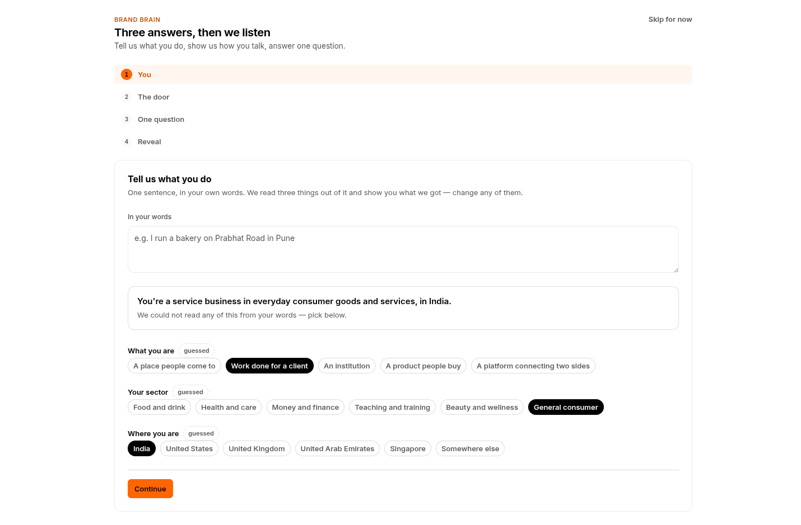
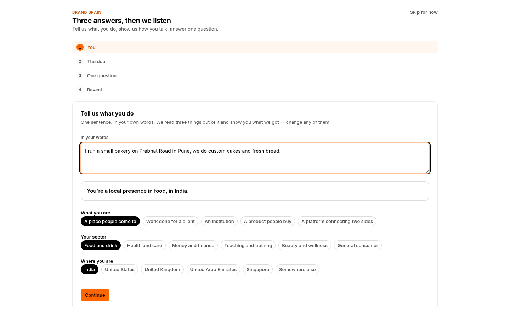
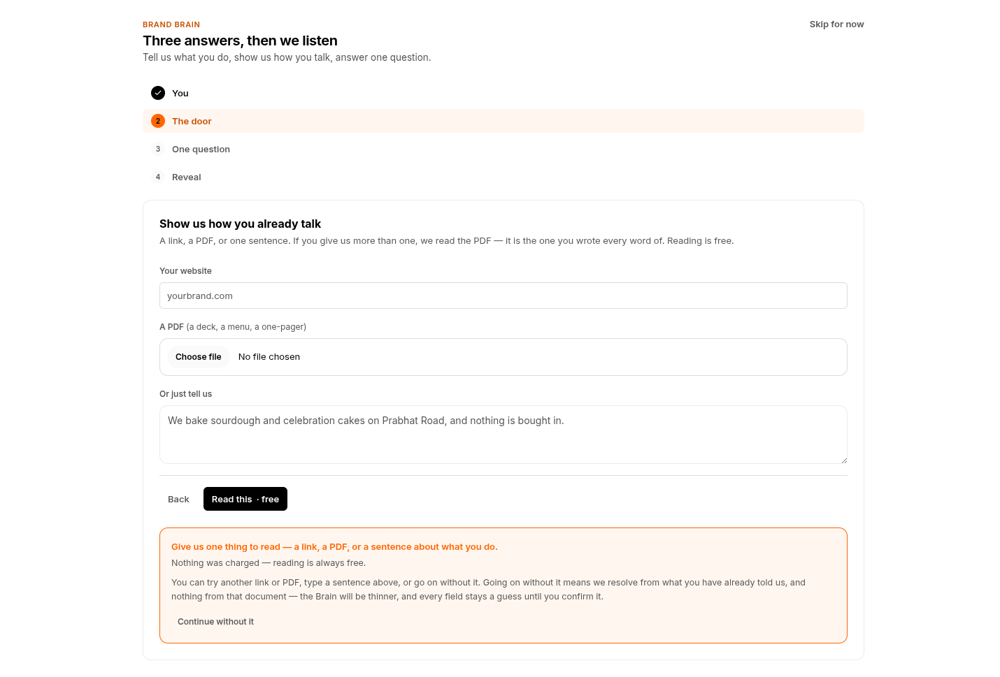
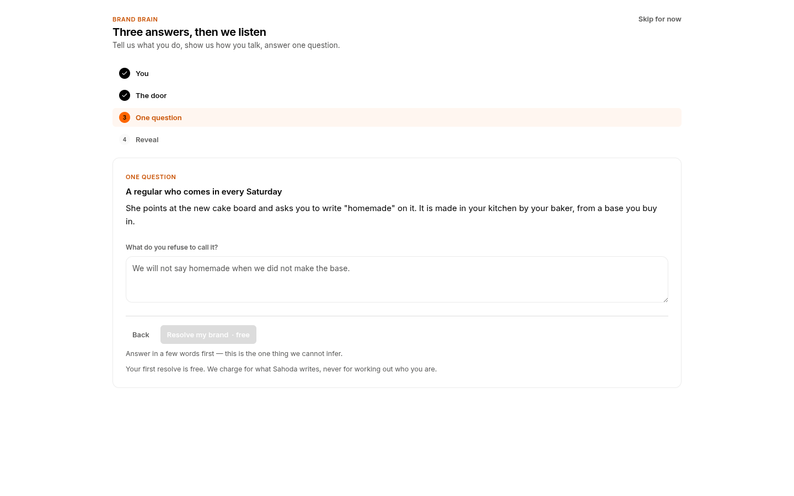
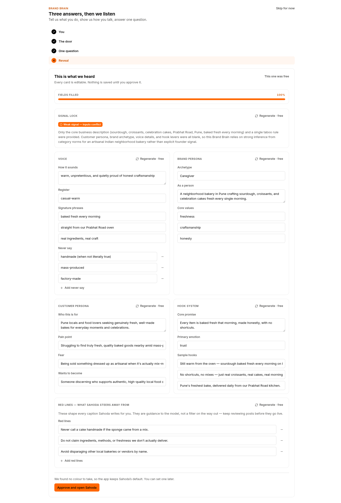
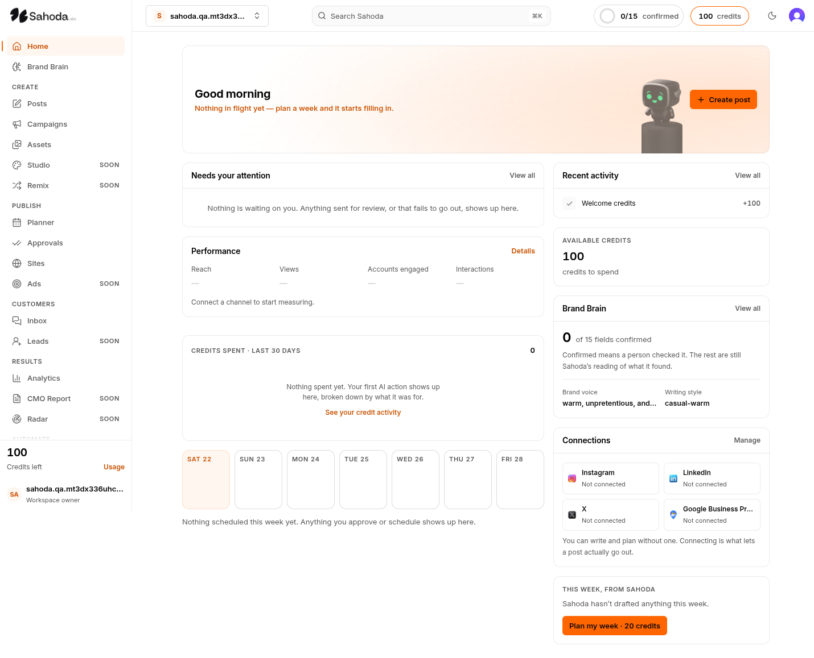
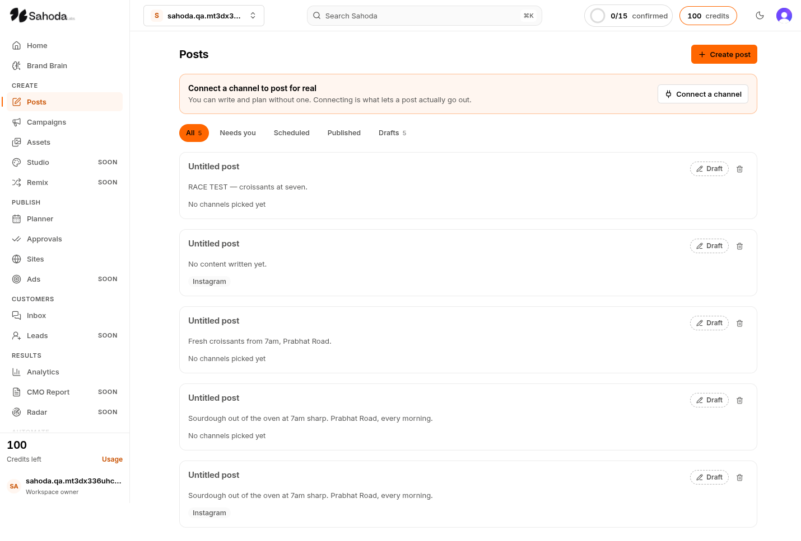
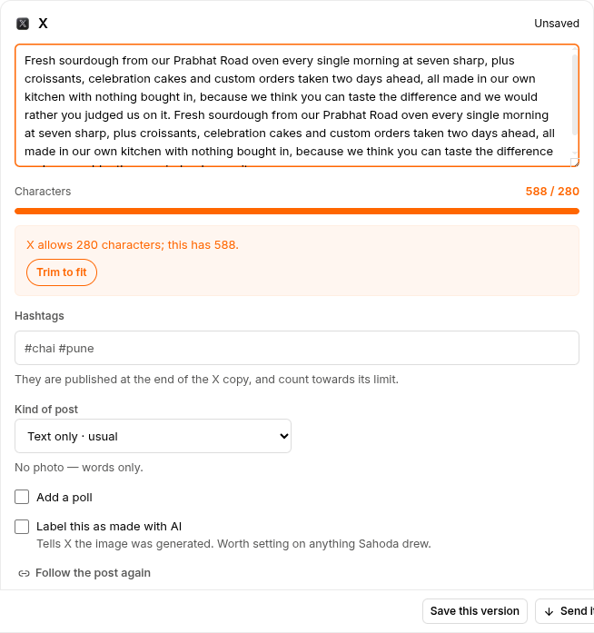
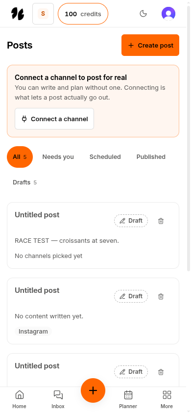
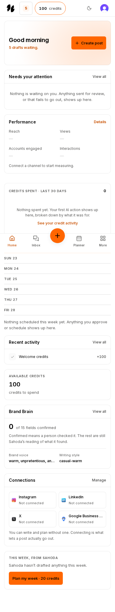

# 33 — QA Report: walking Sahoda as five people

**For the founder.** 2026-08-22. Branch `wt-qa`, cut from `wt-integrate` at `196c0fd`.

This is not a test run. Nobody had walked this product — 239 commits and 815 files of green
tests, gates and database reads, and not one person trying to get something done. So I opened
a real browser against a real production build and tried to run a bakery with it.

Where I say "measured", there is a number and you can re-run it. Where I was wrong, I have
said so and shown the measurement that corrected me — there are **five** of those, and one of
them I nearly shipped to you as a defect.

**What "looked at" means here**, because it is the difference between this report and a test
run. I opened and read the frames of **22 screens**. I *measured* all 39 without opening every
one. The distinction matters: the failure this pass was commissioned to catch — a peer's 56
fully passing frames while the orb, the whole argument of the screen, was absent — is invisible
to measurement. Only a pair of eyes catches it.

- **Looked at** (frames read, several at two widths and both themes): `/sign-in`, `/home`,
  `/onboarding` (all four steps plus two error states), `/posts`, `/posts/new`, `/brain`,
  `/brain/resolve`, `/brain/competitors`, `/campaigns`, `/assets`, `/studio`, `/planner`,
  `/approvals`, `/sites`, `/inbox`, `/analytics`, `/connections`, `/wallet`, `/settings`,
  `/settings/plan`, `/loop`, `/design-system`.
- **Measured but not opened** (17): the four remaining `/brain/*` tabs, the five `/ads/*`
  screens, `/remix`, `/leads`, `/report`, `/radar`, `/playbooks`, `/inbox/comments`,
  `/inbox/reviews`, `/settings/profile`, `/settings/integrations`, `/create`. All but the
  `/brain/*` tabs are unbuilt "Soon" screens, and I read three of that family in full
  (`/studio`, `/radar` via `/brain/competitors`, and the nav treatment) — they share one
  template, described below. **If something is visually missing on those seventeen, this
  report would not know.**

---

## Read this part first: what this pass did NOT see

This tree is behind four lanes that are already built. Measured with `git diff --stat`:

| lane | ahead | what it changes |
|---|---|---|
| **wt-onboard2** | 8 commits | **Rebuilds `/onboarding` completely** — +3,870 lines on the route, plus a 2,242-line stylesheet |
| wt-media | 10 commits | per-channel crops, `asset_derivatives` |
| wt-webhooks | 10 commits | Zernio webhook receiver, store-backed inbox |
| wt-remix | 7 commits | `/remix` and `/leads` built for real |

Two consequences you need to hold while reading:

1. **Journey 1 below walks the OLD onboarding.** It is the journey I have the most to say
   about, and there is a rewritten version of that screen sitting on another branch. Judge the
   *shape* of what I found there, not the pixels.
2. **Remix, Leads and The Loop show as "Soon" in the navigation because on this tree they
   are.** That is the honesty gate working correctly, not a regression.

---

## How I looked, and why that matters

Stated because a report that says "we found no invisible text" is only worth reading if you
know what would have caught it.

- **A production build**, not a dev server. `next start` was ready in **946ms**; the dev server
  is documented in this repo at **92 seconds** to ready with ~50s route loads. Every timing
  below is a product measurement, not a Turbopack measurement.
- **Real Chromium.** Lightpanda was available on port 3338 and I did not use it: its
  `screenshot()` writes a placeholder that passes a size check and its `getBoundingClientRect`
  returns 5×5. A browser that invents frames is disqualified from a pass whose whole thesis is
  that a frame tells you what is there.
- **A fresh account**, signed up and taken through onboarding by hand. Being straight about
  how the five journeys were actually run, because the shapes differ:
  **J1 (new user)** was walked end to end by hand, click by click — it is the one with real
  depth. **J2 (returning user)** reused J1's account rather than a separate one, which is what
  a returning user is, but it means J2 saw exactly the drafts J1 made. **J3 (person with
  nothing)** was walked as a genuinely empty second account for the workspace-less screens, and
  otherwise assembled from the empty states across all 39 routes. **J4 (mistakes)** got two real
  probes — an empty required input, and 588 characters into a 280-character field — not the
  full set the brief named; zero balance mid-action, a stale version and a wrong image size were
  **not** tested by hand (`concurrent-edit.spec.ts` covers the two-tab case in the suite).
  **J5 (phone)** is the 390px half of the automated sweep plus the frames I read.
- **234 automated captures** — 39 routes × three widths (1440, 1024, 390) × light and dark —
  each one screenshotted and audited for accessible names, touch targets, truncation,
  horizontal overflow, cursor affordance and console errors.
- **Contrast measured in pixels, not colour values.** This is the important one. The usual
  method reads `getComputedStyle(el).backgroundColor`, gets `rgba(0,0,0,0)` for anything
  transparent, and compares text against transparent; the usual "fix" walks up the ancestors
  and lands on a token that can resolve to the same colour as the text. That is how a real
  white-on-white finding gets retracted as a "measurement artifact" — both the claim and the
  correction are computed from colour values, and neither is what your eye receives. So
  instead I cropped every text region out of the delivered PNG and measured its luminance
  variance. A region that contains text and is perfectly flat is invisible text, and no
  argument about tokens can talk you out of it.

  I validated that detector against known controls before trusting a single zero:

  | control | measured | verdict |
  |---|---|---|
  | white text on white | sd **0** | below threshold — would be caught |
  | black text on white | sd **45.05** | far above |
  | #f2f2f2 on white (~1.07:1) | sd **2.61** | lands in the low band |

  **10,982 text regions measured. Zero invisible text, in either theme.** The 12 candidates it
  raised were all inside one collapsed `<details>` accordion on `/loop` titled "What each
  level means" — content a closed accordion is *supposed* not to paint.

---

# The five journeys

## 1. The new user

*Signs up, sets up a Brand Brain for a bakery on Prabhat Road, reaches a first post.*

**What worked.** More than I expected. Signing in lands on a bare `/home` that says, plainly,
"Everything in Sahoda lives in a workspace… Nothing has failed and nothing was charged; there
is simply nothing to show until one exists." One button. Then the Brand Brain setup: four
steps, and the second one — "Show us how you already talk" — is a genuinely good idea, with
"Read this · free" written on the button.

**Where it lied to me.** Before I had typed a single character, step 1 asserted in bold:

> **You're a service business in everyday consumer goods and services, in India.**
> We could not read any of this from your words — pick below.

Two sentences, two lines apart, and the box was empty. Three chip groups sat pre-selected, each
badged "guessed". Nothing had been guessed, because nothing had been written.

The engine underneath is fine — I typed *"I run a small bakery on Prabhat Road in Pune"* and it
moved to `local_presence` / `food` / `India` and both the false sentence and the badges
correctly vanished. The defect was only the empty state, and it is **fixed**.




**Where it made me stop.** I pressed "Read this · free" with nothing filled in, expecting a
refusal. Instead:

> Give us one thing to read — a link, a PDF, or a sentence about what you do.
> **Nothing was charged — reading is always free.**
> You can try another link or PDF, type a sentence above, or go on without it. Going on without
> it means we resolve from what you have already told us… the Brain will be thinner, and every
> field stays a guess until you confirm it.
> [Continue without it]

That is the best error message in the product. It names what it needs, clears the money worry
before I asked, spells out the cost of skipping, and gives me a working way out.



**Where it delighted me.** Step 3 asked me one question, and it was *mine*:

> **A regular who comes in every Saturday.** She points at the new cake board and asks you to
> write "homemade" on it. It is made in your kitchen by your baker, from a base you buy in.
> **What do you refuse to call it?**

I answered. It turned my sentence into a rule on the spot — *"Never call a cake handmade if the
sponge came from a mix"* — and later that exact rule appeared in the finished brand, alongside
`Never say: handmade (when not literally true)`. That is the product's argument, working.



**Where it went quiet on me.** I pressed "Resolve my brand". Nothing happened. No spinner, no
disabled button, no text change — the screen was pixel-identical. So I pressed it again. The
network log shows `POST /onboarding` returning **200 OK twice**: the action ran twice because
the screen never admitted it was working the first time.

**Where the biggest number on the screen was the least true thing on it.** The reveal screen
leads with a full-width orange bar reading **FIELDS FILLED 100%**. Directly beneath it, the
same card says:

> ⚠ Weak signal — inputs conflict
> Customer persona, brand archetype, voice details, and hook levers were **all blank**, so this
> Brand Brain relies on strong inference from category norms… **rather than explicit founder
> signal.**

100% and "all blank", touching. The 100% counts whether boxes contain text, not whether any of
it came from you.

And the product already knows better — **in three other places, all of which disagree with it**:

| screen | what it says about the same brain |
|---|---|
| `/onboarding` reveal | **FIELDS FILLED 100%** |
| `/home` | 0 of 15 fields confirmed — "Confirmed means a person checked it. The rest are still Sahoda's reading of what it found." |
| `/brain` | Brand confidence **0/15** — "0 confirmed by you · 15 still Sahoda's guess" |
| `/brain/resolve` | "**15 of 15 fields are still Sahoda's guess.** 11 of them are things only you can actually know." |

Three screens agree with each other and one disagrees with all three — and the one that
disagrees is the first one a new customer ever sees, at the moment you are asking them to trust
what you built. Everything needed to fix it already exists and is already computed.

(Also: "inputs **conflict**" is the wrong word here. My inputs were sparse, not contradictory.)



**Where I could not read my own brand.** Five fields on that screen truncate at 1440px — the
widest screen most people own. Measured `scrollWidth` against `clientWidth`:

| field | overflowing by | visible |
|---|---|---|
| Pain point | 154px | 75% |
| Fear | 145px | 76% |
| Wants to become | 84px | 84% |
| Sample hooks 1 | 84px | 84% |
| Sample hooks 2 | 12px | 97% |

"Who this is for" — the same kind of sentence, in the same card, at the same width — wrapped
perfectly, because it was the one marked `multiline`. **Fixed**: the three persona fields now
hold a sentence.

**Verdict on journey 1.** Six clicks and three typed answers from signed-out to a real brand, and the
content at the end was genuinely good and clearly derived from what I said. But the flow tells
two lies on the way — one before I type anything, one in the largest element on the payoff
screen — and goes silent during the one moment it is doing the most work.

## 2. The returning user

*A workspace with a Brand Brain and five drafts. Can they find what they were doing?*

The home screen answers "what needs me" well. "Needs your attention" is first and says
"Nothing is waiting on you. Anything sent for review, or that fails to go out, shows up here."
Performance shows four em-dashes and "Connect a channel to start measuring" rather than four
fake zeros. The Brand Brain card shows `0 of 15 confirmed` with the honest definition.
"Plan my week · 20 credits" states its price before you press it.



**Where it falls down is the drafts.** All five of my drafts are called **"Untitled post"**.
None carries a date, a time, or any ordering cue. Two of them have byte-identical bodies. I
made those five in about fifteen minutes of normal use; I could not tell you which is which,
and neither can the screen.



The composer *has* a "Name this post — only you see this" field at the very top. Nothing ever
asks you to use it, and nothing falls back to the first line of the body.

Two smaller things in the same area: picking a channel and then leaving strands an empty draft
forever ("Untitled post / No content written yet / Instagram"), and the workspace itself is
named after your email address — mine was `sahoda.qa.mt3dx336uhcws1+clerk_test's workspace`,
truncated in two places — even though I had just told the product I run a bakery.

## 3. The person with nothing

*No connection, no posts, no credits. Every empty state in sequence.*

**This is the product's strongest journey**, and it is not close. Every empty state is written,
not blank, and each one states its claim precisely:

- "Nothing is waiting on you. Anything sent for review, or that fails to go out, shows up here."
- "Nothing spent yet. Your first AI action shows up here, broken down by what it was for."
- "Photos attach to a saved post. Write a line and Sahoda saves it, then this becomes a place to add one."
- "You can write and plan without one. Connecting is what lets a post actually go out."
- "Sahoda can't post here yet." (on the four unbuilt channels)

`/connections` is the best of them. It separates "Publishes today" from **"Not proven live"** —
a distinction most products would quietly not make — and on X it volunteers:

> **X POSTS THIS MONTH · 0 of 12.** 12 left. X bills Sahoda $0.015 a post, and $0.20 when it
> carries a link, so this allowance is ours rather than X's.

Telling a customer that a limit is *your* cost ceiling rather than the platform's is unusually
honest.

**The one place it slips.** A brand-new account with no workspace is told, by the sidebar, that
"Your credit balance **could not be read**" and "Your role in this workspace **could not be
read**" — while the main pane of the same screen says "Nothing has failed and nothing was
charged." Sighted users see a neutral `···`; only screen-reader users hear the failure. Nothing
had failed. There was no workspace to have a balance yet. **Fixed** — with care to keep saying
"could not be read" when a read genuinely fails.

## 4. The person who makes a mistake

Mixed, and the good half is very good.

**Excellent.** I pasted 588 characters into an X post. The counter turned orange and read
`588 / 280`, the field went `aria-invalid`, and the panel said "X allows 280 characters; this
has 588" — with a **"Trim to fit"** button that actually does something. Below it, unprompted:
"Hashtags… are published at the end of the X copy, and count towards its limit", and "Channel
limits still apply to text-only posts." That is a screen that has thought about the *second*
mistake you are about to make.



Choosing Instagram with no photo says "Instagram needs at least one photo — there is no
text-only post" *before* you waste any effort.

**Poor.** Two things make an empty required field look like a finished answer:

- Step 2's "Or just tell us" placeholder is *"We bake sourdough and celebration cakes on Prabhat
  Road, and nothing is bought in."*
- Step 3's answer box has an empty value and the placeholder *"We will not say homemade when we
  did not make the base."* — twelve words, ending in a full stop, **directly above a disabled
  primary button**.

You look at a filled-looking box and a dead button and conclude the button is broken.

And the one escape route out of step 2 — **"Continue without it"** — is a `<button>` with a
transparent background, no border, no underline, grey `rgb(87,87,86)` text, 28px tall, and an
arrow cursor. It is the only way forward for someone with no website and no PDF, and it looks
like a caption.

## 5. The phone

*Everything above at 390px.*

Better than I expected, and the automated sweep backs that up rather than contradicting it.

- **Horizontal overflow across 39 routes at 390px: one route, `/design-system`, by 16px.** That
  is an internal component gallery, not a customer screen. Nothing else overflows anywhere.
- **Touch targets: effectively clean.** The sweep raised 28 candidates. Every one dissolved on
  inspection: most are inline links inside sentences ("the composer", "the overview"), where
  44px does not apply; the 13×13 plan radios on `/wallet` have a **320×82** label wrapping the
  whole card; the 91×20 "Untitled post" title on `/posts` sits inside a card whose middle
  is itself inside the link — I hit-tested it. Two genuine 18×18 buttons live on
  `/design-system`.
- The bottom navigation (Home · Inbox · **+** · Planner · More) is a proper mobile pattern, and
  the composer's sticky action bar deliberately stops 56px short of the floor so it never covers
  it.




Two real phone nits: "Brand voice" truncates to *"warm, unpretentious, an…"*, and the filter row
wraps so "Drafts 5" is orphaned on its own line where it reads as a heading rather than a tab.

## Keyboard, and what a customer on 4G actually waits

Two things the sweep could not answer, so I measured them separately
(`.qa/keyboard-and-throttle.mjs`).

**Keyboard.** P2 asks first whether a flow can be completed with the keyboard alone. Onboarding
step 1 — the flow that matters most — **can**:

| check | result |
|---|---|
| reached "Continue" by Tab alone | yes, in **6 stops** (Skip · the box · three chip groups · Continue) |
| stops with no visible focus ring | **0 of 6** |
| ArrowRight inside a chip group | moved the selection (`local_presence` → `service`) |
| Enter on "Continue" | advanced to step 2 |

The three chip groups are one tab stop each rather than one per chip, and arrow keys move
within them — which is exactly what `pick-chips.tsx` says it chose native radios to get, and it
is worth noting that the claim in the comment is true. I did not walk the remaining flows by
keyboard; that is the disclosure, not a finding.

**Throttled loads.** The 1.7–2.4s quoted earlier is `networkidle` over loopback and is not a
customer's experience. Re-measured at 150ms RTT, 1.6 Mbps down and a 4× CPU slowdown — roughly
a mid-range Android on 4G:

| route | first contentful paint | networkidle |
|---|---|---|
| `/home` | 724ms | 3288ms |
| `/posts` | 660ms | 2099ms |
| `/brain` | 684ms | 2229ms |
| `/connections` | 1024ms | 2387ms |
| `/planner` | 612ms | 2216ms |

Something is on screen inside a second everywhere, and the slowest route settles in 3.3s. That
is a genuinely good result and it survives leaving the laboratory — which is the only reason it
is worth quoting.

---

# Every defect

**Fixed in this branch**

| # | What | Where | Severity |
|---|---|---|---|
| 1 | Asserts a conclusion about your business over an empty input, badged "guessed" | `/onboarding` step 1 | **High** |
| 2 | Sidebar tells screen-reader users a read *failed* when there is simply no workspace yet | every signed-in screen | Medium |
| 3 | Every `<button>` in the product shows an arrow cursor instead of a hand | product-wide | Medium |
| 4 | Three sentence-length brand fields truncate at 1440px | reveal screen | Medium |
| 5 | `/sites` told a workspace with a fully resolved Brand Brain to "Resolve your Brand Brain first" — the tip rendered whenever no site existed, with no reference to brain state | `/sites` | Medium |

**Addendum, 2026-08-22 — all seventeen dispositioned on `wt-fix1`**

Written by the lane that worked the list, not by the pass that wrote it. Every item below
either landed, was proven to belong to another branch, or was WITHDRAWN with the measurement
that killed it. Nothing was closed by assertion.

| # | disposition |
|---|---|
| 5 | **Fixed.** The reveal counts CONFIRMED fields via `brainRing`, the same authority `/home`, `/brain` and `/brain/resolve` already read. All four screens now say the same number. `signal-clarity.ts` and its meter are deleted — the reveal was their only consumer. |
| 6 | **Fixed.** A `useRef` money guard plus a render mirror, released on `[state]` and never on `[isPending]`. The obvious test was a proven FALSE GREEN: React 19 queues actions, so a never-settling mock swallows the second dispatch even with no guard at all. |
| 7 | **Fixed.** A heading is derived from the first non-blank body line, capped at 60 code points, carrying its provenance so only a genuine placeholder is styled as one. Cards carry a "Saved <age>" stamp. |
| 8 | **Fixed.** `exampleHint` frames every specimen as an example and drops the terminal full stop, applied at the render because there are twenty-odd specimens across four regimes and two locales. |
| 9 | **Fixed.** "Continue without it" wears the firm ring and ink text every real choice wears. Secondary, not primary: reading the door is still the better path. |
| 10 | **Fixed** for the date control — the picker follows the app's theme rather than the OS. |
| 11 | **Fixed.** Title and chip no longer share a row, with a seven-width e2e spec covering the 768–1279 band this report did not sample. |
| 12 | **Fixed.** A row is created only when there is content, or when an action genuinely needs one. |
| 13 | **Fixed.** The display name no longer touches the email address; the slug seed still does, and that is load-bearing rather than tidy. |
| 14 | **Fixed.** `weak` states the strength; the note keeps the reason. It no longer asserts a conflict over sparse input. |
| 15 | **Fixed.** The read-back belongs to the url and pdf arms, which are the ones where it is evidence. |
| 16 | **Not ours, verified.** No `alt` of that shape exists anywhere in `apps/web`; it is generated inside Clerk's own `<UserButton />`. |
| 17 | **Fixed.** A real multi-size `.ico` plus scheme-aware PNGs. |
| 18 | **WITHDRAWN — see below.** |
| 19 | **Fixed.** Said once per group, with the per-field distinction moved into each checkbox's accessible name so a screen reader still hears it. |
| 20 | **Mostly dissolved, one sentence added.** Those controls were already inert divs rather than disabled buttons, and `design-lint` enforces that at strict zero. What was missing was the denial where a reader looks for the collection. |
| 21 | **Fixed.** The spatial instruction is gone and the context pane's prompt renders only when there is something to open. |

**Item 18 was a false finding, and the instrument produced it.** `/brain/competitors` was ALREADY
a `redirect('/radar')` on `wt-integrate` — the exact tree this pass walked. Every clause of the
finding is a correct description of a working redirect. The real defect was that both audit
harnesses still listed the path, so the sweep photographed Radar twice and filed half the frames
under a route that renders nothing. The route is out of both harnesses and a guard now refuses to
point either camera at a redirect. This belongs in "What I got wrong" as a sixth entry: **a camera
pointed at a redirect manufactures findings about a screen that does not exist.**

**Two items are not this branch's to fix, established by measurement rather than by argument.**
The Radar rung ruling needs `components/radar/`, which exists only on unmerged `wt-radar-ui`; the
docs/26 §3.1b amendment landed here, the two class swaps are owed there. The Playbooks held-slot
copy needs `wt-playbooks`, which carries 30 playbook files against this branch's single stub page.

**One thing this pass could not have known.** `wt-onboard2` renders `OnboardingStage`, not
`OnboardingFlow` — so on that branch the whole old onboarding tree, `RevealStep` included, is
unreachable. The fixes to items 5, 6, 8, 9 and 15 are correct for the tree that is DEPLOYED today
and will need porting when that lane merges. Its stage already counts "signals the customer
actually gave", which is the same principle arrived at independently.

**Logged, not fixed**

| # | What | Where | Severity | Why not fixed here |
|---|---|---|---|---|
| 5 | "FIELDS FILLED 100%" above "Weak signal… all blank" | reveal | **High** | The meter needs to count *confirmed*, not *filled* — the home screen already does. That is a product decision about a number you show, not a paint fix. |
| 6 | Resolve runs for seconds with zero pending state; double-click ran it twice | onboarding step 3 | **High** | Needs a pending state **and** submit-once guarding. Worth doing together. |
| 7 | Every draft is "Untitled post", no date on the card | `/posts` | **High** | Needs a naming rule (first line? channel + date?) — your call, not mine. |
| 8 | Placeholders written as finished sentences above a disabled button | onboarding 2 & 3 | Medium | Copy decision. |
| 9 | "Continue without it" — the only remedy, styled as caption text | onboarding 2 | Medium | Trivial, but it sits in the flow wt-onboard2 replaces. |
| 10 | Raw unstyled `<input type=file>` and `<input type=datetime-local>` | onboarding 2, composer | Medium | Needs a designed control in the system. |
| 11 | Platform names truncate at 1440px: "Google Business Profile" 47% shown, "Facebook Pages" 75% | `/connections` | Medium | Title and badge share one row; needs a layout decision. |
| 12 | Picking a channel then leaving strands an empty draft forever | composer | Medium | Tied to #7. |
| 13 | Workspace is named after your email address | onboarding | Low | You just told it you run a bakery. |
| 14 | "inputs conflict" shown when inputs were merely sparse | reveal | Low | Copy. |
| 15 | The read-back mirrors your own typed sentence back verbatim | onboarding 2 | Low | Meaningful for a link or PDF, vacuous for typed text. |
| 16 | `alt="'s logo"` on the avatar | topbar | Low | **Not ours** — it is inside Clerk's `<UserButton />`, and the wrapping button's `aria-label="Open user menu"` masks it. Cosmetic only. |
| 17 | No favicon (404) | all | Low | One file. |
| 18 | `/brain/competitors` renders the **Radar** screen — h1 "Radar", sidebar highlighting Radar, and it is not in the Brain's own tab bar | `/brain/competitors` | Low | Two URLs for one screen. Reachable only by typing the address, so nobody meets it by accident. |
| 19 | On `/brain/resolve` the 30-word disclaimer "Only you know this. Sahoda is not entitled to answer this one…" repeats **verbatim under all 11 fields** | `/brain/resolve` | Low | The most-repeated element on the screen carries information you need once. Say it once at the top of the group. |
| 20 | `/studio` is a "Coming soon" screen carrying a **"New design" button** and five filter chips, over a gallery its own footer says does not exist | `/studio` | Low | Controls that cannot do anything. Same question on `/brain/competitors`' "Add a competitor". |
| 21 | `/inbox` at 1440 renders **three empty panes at once**, one of which reads "see the panel beside this one" | `/inbox` | Low | Reads as broken scaffolding before a connection exists. Correct at 390, where it collapses to one pane and the spatial instruction disappears. |

---

# What I got wrong

Five claims I formed and then killed. Each with the measurement that killed it, because a wrong
retraction is worse than no check — and one of these I would otherwise have sent you as a
serious bug.

1. **"The composer never puts the post's id in the URL, so a reload loses your work."**
   I watched the address bar stay on `/posts/new` after "Post saved", reloaded, and got a blank
   composer. **Wrong.** On two clean retries the URL adopts the id at **2.5 seconds**
   (`/posts/d421d335-…`, `/posts/dc8b30db-…`) via `history.replaceState`, guarded on the save
   being confirmed. A reload before that is honest too — measured at 1.2s the status reads
   "Post not saved yet", which was true; nothing had been written. I had navigated away in the
   same instant the status text appeared. The duplicate drafts are real, but the cause is #7,
   not a lost URL.

2. **"The autosave bar covers the 'Send it' heading."** I had a live hit-test:
   `elementFromPoint` at the heading returned the status paragraph, 15px of overlap across
   1000px. **Wrong.** The bar is `sticky bottom-0`, and covering not-yet-scrolled content is
   what a sticky footer does. The question that settles it is what happens at the *bottom* of
   the page: scrolled to the floor (283 = max), `elementFromPoint` at the heading returns
   `H2 :: Send it` — the heading itself — and the last control reports `covered: false`. The
   file's own header warns about exactly this class of false finding.

3. **"Eight regions of invisible text on `/loop`."** My own detector's fault. The frame is
   1440×**1017** and those boxes sat at y=1019–1103 — outside the image. My code *clamped* to
   the edge, sampled a 2px sliver of flat background, and reported `sd=0`, which is precisely
   the signature it exists to detect. A detector whose out-of-range behaviour is
   indistinguishable from its positive result is worse than no detector. Fixed to reject rather
   than clamp, and re-run.

4. **"The hero mascot is clipped by the card."** **Wrong.** `background-size: contain` cannot
   clip. The source artwork (`/mascot/0.png`, 2048×983) has its pedestal bled off the bottom of
   the frame by design.

5. **"The primary button turns black."** **Wrong** — that is the hover state. Measured with the
   pointer moved away: resting `rgb(255, 102, 0)`.

Two more things I checked because a peer had reported them, and which are **genuinely fixed on
this tree**: the nine unnamed navigation links (0 unnamed interactive elements across all 234
captures) and a 4.7s load to `/posts` (measured 1.7–2.4s to `networkidle` on every route, on a
production build over loopback — the peer's number was almost certainly a dev-server artifact,
but "no skeleton, no spinner, no change" is a real defect at any latency and is item 6 below).

---

# The three worst screens

1. **The Brand Brain reveal** (`/onboarding` step 4). The content on it is excellent. The
   framing is not. The largest, brightest element reports **100%** about a brain the same card
   calls weak and blank, five of its fields are cut off mid-sentence at full desktop width, and
   the screen you land on immediately afterwards contradicts it with a truer number. This is
   the screen where you ask for trust, and it is the screen that overclaims.

2. **`/posts`.** Five rows, one name, no dates. The list becomes unusable inside one sitting,
   and the fix — a name, or a date on the card — is not hard.

3. **`/onboarding` step 1, empty.** It is the first thing a new customer reads and it asserted
   something untrue about their business before they touched the keyboard. Fixed, but it earns
   its place here because of *where* it sat.

# The three best screens

1. **The Brand Brain confidence system** — `/brain` and `/brain/resolve` together. `/brain`
   leads with "Brand confidence 0/15 · 0 confirmed by you · 15 still Sahoda's guess" and then
   explains why it matters in one sentence: *"A guess Sahoda got wrong is wrong in everything it
   writes until someone corrects it — and correcting one costs nothing."* `/brain/resolve` then
   ranks the 15 fields by **whose knowledge they are** — "11 of them are things only you can
   actually know… those come first, because a guess there is worth the least" — marks each
   Confirm as free, and admits a hard limit rather than faking it: *"Sahoda cannot show which
   sentence produced which field… nothing links a field back to a line in your document — and
   it will not invent one."* I have not often seen a product decline to fabricate provenance.

2. **`/connections`.** It separates "Publishes today" from **"Not proven live"** — a distinction
   most products would quietly not make — tells you the four unbuilt channels can't post yet
   rather than hiding them, and volunteers that the X post allowance is *Sahoda's* cost ceiling
   rather than X's, with the per-post price: "X bills Sahoda $0.015 a post, and $0.20 when it
   carries a link, so this allowance is ours rather than X's."

3. **The X version card, over the limit.** An orange `588 / 280`, a plain sentence, a **working**
   "Trim to fit" button, and two warnings about mistakes you have not made yet ("hashtags…
   count towards its limit"; "Channel limits still apply to text-only posts"). This is what
   every error state in the product should be measured against.

**Honourable mentions**, because the pattern behind them is the real asset. The unbuilt screens
share one template and it is unusually principled: a "Coming soon" badge, then *"This is the
screen as it will be. Nothing on it is connected yet, and no numbers are shown because there is
nothing to measure."* `/radar` goes further with a section headed **"What Radar will never tell
you"**, listing three things it cannot know and will not invent (competitor spend, anything
behind a login, revenue), and prices a scan at 5 credits with "a page that will not load is
skipped and not charged". `/studio` refuses to quote a price that has not been decided: *"A
short video slideshow will be priced too. Its rate is not set in the price list yet, so this
page does not quote one."* And the empty-input error on onboarding step 2, quoted in full above.

---

# If I had another week

1. **Make the reveal's headline number the confirmed count.** The home screen already computes
   and explains it. One number, told the same way in both places.
2. **A pending state on every model call, and a submit-once guard behind it.** Resolve is the
   worst case; audit the rest.
3. **Name posts.** First line of the body, or channel plus date. Then delete abandoned
   channel-only drafts.
4. **Two designed controls** — a file picker and a date/time picker — and the two raw native
   inputs disappear.
5. **A "no words yet" audit.** The empty-onboarding fabrication and the sidebar's false failure
   are the same bug wearing different clothes: a screen making a claim before it has grounds.
   The codebase already has the vocabulary for this (`Unmeasured` / `Unreadable`, and now
   `NotYet`, plus `lib/inbox/emptiness.ts`). Apply it everywhere a value can be absent.
6. **Then re-run this pass against `wt-onboard2`**, since it replaces the screens journey 1
   spends most of its time in.

---

# The verdict

**Is this ready for fifty small businesses? Not this week. Close enough that the gap is
countable, and none of it is architectural.**

What I can tell you with evidence:

- The product is **honest by construction**, and that is rare. Costs are shown before spend
  ("Read this · free", "Plan my week · 20 credits", "Regenerate · free"). Absence is written
  carefully enough that the codebase has three separate components for three different kinds of
  nothing. Unbuilt features say "not built yet" instead of hiding.
- It is **solid underneath**. 234 page loads across 39 routes at three widths in two themes:
  **zero console errors**, **zero unnamed interactive elements**, **zero horizontal overflow**
  on any customer screen, **zero invisible text** in 10,982 measured regions. Every route
  answered in 1.7–2.4 seconds on a production build **over loopback**. Nothing crashed. Nothing
  500'd. Read the throttled numbers below before taking that 1.7s as a customer's experience.
- The **generated content is good**, and visibly derived from what the customer said. That is
  the hard part and it works.

What stops it being ready is smaller and more embarrassing than that summary suggests: a setup
flow that claims to have guessed before you type, a payoff screen whose biggest number
overstates the thing you most need to trust, a button that runs an expensive action twice
because it never admits it is working, and a drafts list where everything is called the same
thing. Four fixes. Two of them are copy and a conditional.

One more thing belongs in the verdict rather than the appendix, because it will cost somebody a
day otherwise: **the smoke leg of `pnpm gate` cannot currently complete on the shared build
machine.** Not because of the tests — the dev server is killed mid-run, once provably by the
kernel's out-of-memory killer while four other worktrees each ran their own dev server. A gate
that fails for reasons outside the branch under test is a gate people learn to skip, and this
repo has already been through that once.

The honest shape of it: **the engineering is ahead of the finish.** Nothing here needs a
rewrite, a migration, or a contract change. What it needs is somebody to sit with the four
screens above and decide what each one is allowed to claim.

And I would not put fifty businesses on it until journey 1 has been re-walked on
`wt-onboard2`, because that lane replaces most of what I just judged.

---

## The gate

Four of five legs green. The fifth cannot complete on this machine, and the reason is not the
code.

| leg | result |
|---|---|
| 1 · `turbo typecheck lint test` | **ok** (83.5s) |
| 2 · `vitest run` (root) | **ok** (2.7s) |
| 3 · `turbo test:smoke` | **failed — the dev server dies mid-suite** |
| 4 · `prettier --check .` | **ok** (17.9s) |
| 5 · `turbo build` | **ok** (109.3s) |

Leg 3 failed on three full runs, and every failure is
`page.goto: net::ERR_CONNECTION_REFUSED at http://127.0.0.1:3238` inside the sign-in fixture —
the server going away, not an assertion about the product. Two of the three causes are proven:

- **Run 1.** `⨯ Could not find the module ".../(app)/error.tsx#default" in the React Client
  Manifest.` I had built for production into `apps/web/.next` in order to serve the QA walk;
  the smoke leg then ran `next dev` (Turbopack) against that same directory. Clearing `.next`
  and re-running the identical gate on the identical tree removed every one of those failures.
- **Run 2.** The kernel OOM killer. `journalctl -k`: `Out of memory: Killed process 925281
  (next-server)`. **Four other worktrees were running their own dev servers at the time** —
  wt-radar-ui, wt-knowledge, wt-radar, wt-playbooks, confirmed by reading each process's working
  directory. They are not mine to kill.
- **Run 3.** Same signature, no kernel OOM in the window. Cause not isolated.

**My changes are not implicated, and that is measured rather than argued.** Same two specs from
the failing set, same machine, back to back, server restarted between:

| tree | result |
|---|---|
| baseline — all eight of my files reverted with `git checkout --` | **6 passed** |
| mine — all eight restored | **6 passed** |

**One thing found in the gate itself, which is worth a line to whoever owns it.** Stage 5
(`turbo build`) leaves a production `.next` behind, and stage 3 (`turbo test:smoke`) runs
`next dev` against that same directory. So a second consecutive `pnpm gate` walks into run 1's
condition. `playwright.config.ts` already documents the reverse hazard — a dev run poisoning a
later `next start` — so both directions are now known; this one is inside the gate's own stage
order. Clearing `.next` before the smoke leg would close it.

---

## Appendix — reproducing this

Raw findings, with every measurement: `docs/33_QA_findings.md` — under `docs/` rather than
beside the scripts because the repo ignores `*.md` everywhere except there, and a report citing
a file the branch does not carry is the same defect this pass was commissioned to find.

Sweep data (234 captures): `.qa/sweep.json`, committed. The 234 raw frames are **not** in the
branch — `.gitignore` excludes `.qa/frames/` at ~25MB, and `.qa/sweep.mjs` regenerates them. The
13 frames this report actually cites are committed at `docs/33_QA_frames/`.

```
# production build, port 3238
pnpm turbo run build --concurrency=1
pnpm --filter @sahoda/web exec next start -p 3238

node .qa/user.mjs new                       # throwaway Clerk user + sign-in URL
node .qa/sweep.mjs <clerkUserId> light,dark 1440,1024,390
node .qa/validate-instrument.mjs            # proves the contrast detector still detects
node .qa/user.mjs rm <clerkUserId>          # clean up
```

`validate-instrument.mjs` is not optional decoration. It is the thing that lets the sentence
"zero invisible text" mean anything.
